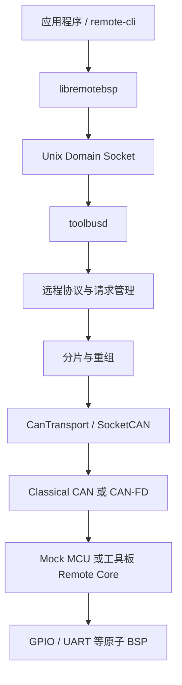

# Remote BSP

Remote BSP 是一个传输无关的远程板级支持框架。Linux 主机通过 CAN/CAN-FD
统一管理多块 MCU 工具板，并像使用本地资源一样调用远端 GPIO、UART 等通用
硬件能力。传感器、Modbus、阀门和厂商协议全部运行在 Linux；MCU 固件只执行
原子硬件操作，不包含设备专用驱动。

当前代码已经打通 Linux 主机、Mock MCU、Classical CAN、CAN-FD 和
STM32F103 实板链路。STM32F103 的 CAN/USB 双模式 Katapult Bootloader 已完成
实体板下载验证；STM32G431 已完成 CAN-FD 发现、心跳、PING、信息查询和 GPIO
实板验证。STM32F072/FLY-D5 与 G431 双模式 Bootloader 的模式切换仍待实板验收。

## 架构



应用程序不得直接访问 SocketCAN。`toolbusd` 独占总线管理职责，包括节点发现、
心跳、请求超时与重试、响应匹配、分片重组、事件分发和本地 IPC。

## 当前能力

| 模块 | 当前状态 |
|---|---|
| 远程包协议 | 版本、消息类型、命令、会话 ID、请求 ID、对象 ID、长度、标志、CRC，小端编码 |
| 分片层 | Classical CAN 8 字节、CAN-FD 64 字节，最大包 2048 字节，超时、重复和非法分片检查 |
| 节点管理 | UUID 发现、节点分配、500 ms 心跳、2 s 离线判定 |
| 请求管理 | 超时、重试、响应匹配、重复请求缓存，避免副作用重复执行 |
| CAN流量控制 | Classical CAN/CAN-FD线时间估算、六类业务预算、发送前准入和统计查询 |
| 远程资源 | GPIO、UART、STEPGEN 运动轴、资源枚举、能力合同、健康状态、复位和会话级租约 |
| 智能步进 Mock | 板卡能力决定的多轴 STEP/DIR/EN 时间线、有界队列、绝对/自动排程、欠载/限位安全停机和状态遥测 |
| Mock MCU | 版本化板卡描述、Classical CAN/CAN-FD、多节点、16 路 GPIO、8 路 UART；默认示例公开3路运动轴，可由描述扩展 |
| STM32F103CBT6 / WeAct BluePill Plus | Classical CAN、GPIO、USART1、双模式 Katapult；板载 PB2 默认启用约 4 秒周期的软件 PWM 呼吸灯；五轴与五路 TMC2209 通讯后端已交叉编译，待实板验收 |
| STM32F072RBT6 / Mellow FLY-D5 | Classical CAN 1 Mbit/s、GPIO、五轴运动与五路 TMC2209 通讯已实板验证；当前未确认可安全占用的板载默认 LED 引脚，故不自动分配呼吸灯；双模式 Katapult 切换待验收 |
| STM32G431CBU6 / WeAct STM32G431CBU6 Core | 外部8 MHz HSE、CAN-FD 500 kbit/s + 1 Mbit/s BRS、PC6 TIM3 PWM 呼吸灯、PC13 GPIO；实板已验证，USB CDC 与双模式 Katapult 待切换验证 |

SPI、I2C、ADC、通用 PWM/Timer 协议和 Storage 已按当前优先级后置，尚未实现。
当前已完成 WeAct G431 PC6 的板级 TIM3 硬件 PWM 呼吸灯和 WeAct BluePill Plus PB2
软件 PWM 呼吸灯支持。BluePill 的实现只使用主循环的 1ms 系统节拍，不新增定时器
中断，也不占用可选运动控制使用的 TIM2/TIM3；两种呼吸灯均可在 `menuconfig` 中关闭。
FLY-D5 不会为演示目的占用加热、风扇、步进或探针资源，待运行时资源清单确认实际指示灯
引脚后再启用。USB
目前只用于 Katapult 恢复升级和 G431 APP 调试输出，不是 RemoteBSP 业务传输。

当前主线优先级为智能步进运动、数字孪生、遥测与监控、图形配置器。Mock 已实现
第一版多轴运动段协议和确定性执行器；Linux 通过 `libremotebsp`/CLI 入队，
MCU 侧模型独立生成 STEP/DIR/EN 时间线，不逐脉冲占用 CAN。F072/F103/G431 的
首版 STEP 定时器后端已接入；TMC 事务并发、跨板时钟同步、持久配置和图形配置器仍待实现。

## 目录

```text
protocol/       远程包、CRC、资源描述和分片协议
transport/      与协议无关的 CAN 传输接口和 SocketCAN 实现
toolbusd/       Linux 守护进程、本地 IPC、发现、心跳和请求管理
libremotebsp/   C++ 应用客户端
mock_mcu/       Linux Mock MCU 与模拟 BSP
boards/         版本化板卡描述、公开资源和内部占用关系
firmware/       STM32 Remote Core、板级 BSP、Katapult 配置和构建脚本
tests/          单元、端到端、vcan 和实体 CAN 测试
docs/           架构、硬件、构建、升级和 API 文档
```

## Linux 主机构建

需要 Linux 或具备 SocketCAN/vcan 的 WSL2，以及 CMake 3.16、Ninja、C++17
编译器和 can-utils。项目开发使用的 WSL 发行版名为 `Ubuntu`。

```sh
sudo apt update
sudo apt install -y build-essential cmake ninja-build can-utils

cd /mnt/d/Documents/RemoteBSP
cmake -S . -B build-wsl -G Ninja \
    -DBUILD_TESTING=ON \
    -DREMOTEBSP_VCAN_INTERFACE=vcan0
cmake --build build-wsl --parallel 32
```

准备 vcan 并运行测试：

```sh
sudo modprobe vcan
sudo ip link add dev vcan0 type vcan 2>/dev/null || true
sudo ip link set dev vcan0 up

ctest --test-dir build-wsl --output-on-failure
```

当前自动测试共 27 项，覆盖协议、CRC、运动线格式、分片、CAN/CAN-FD 帧、SocketCAN、
发现、心跳、多节点、请求超时与去重、GPIO、UART、资源模型和嵌入式 Remote
Core，并单独测试资源租约冲突、续租、会话释放、到期、安全状态、统一板卡描述、
数字孪生故障隔离、可变轴数同步边沿、MCU可裁剪运动队列、运动欠载/限位停机、
CAN-FD BRS、业务分类和
低带宽准入拒绝。

## 快速运行完整模拟链路

打开三个终端。

终端一启动 Mock MCU：

```sh
cd /mnt/d/Documents/RemoteBSP
./build-wsl/mock_mcu/mock_mcu vcan0 classical
```

终端二启动 `toolbusd`：

```sh
cd /mnt/d/Documents/RemoteBSP
./build-wsl/toolbusd/toolbusd vcan0 classical /tmp/toolbusd.sock
```

终端三通过本地 IPC 操作节点：

```sh
cd /mnt/d/Documents/RemoteBSP
./build-wsl/remote-cli node-list
./build-wsl/remote-cli --node 1 ping hello
./build-wsl/remote-cli --node 1 get-info
./build-wsl/remote-cli --node 1 get-capability
./build-wsl/remote-cli traffic-status
./build-wsl/remote-cli --node 1 resource-list
./build-wsl/remote-cli --node 1 resource-contract 0x0100000d

# Mock阶段可以先取得GPIO 13的5秒独占租约，命令会返回lease_id。
./build-wsl/remote-cli --node 1 resource-acquire \
    0x0100000d 5000 exclusive

./build-wsl/remote-cli --node 1 gpio-create 13 output 0
./build-wsl/remote-cli --node 1 gpio-write 1 1
./build-wsl/remote-cli --node 1 gpio-read 1

./build-wsl/remote-cli --node 1 uart-create 0 115200 8 none 1
./build-wsl/remote-cli --node 1 uart-write 2 hello
./build-wsl/remote-cli --node 1 uart-read 2 64

# GPS等持续输入使用流式对象；对象ID以实际返回值为准。
./build-wsl/remote-cli --node 1 uart-create 1 115200 8 none 1 stream
./build-wsl/remote-cli --node 1 uart-stream-read 3 1024 1000
./build-wsl/remote-cli --node 1 uart-write-all 3 long-message 3000

# 运动轴要求独占租约。默认 Mock 示例的三路资源 ID 如下。
./build-wsl/remote-cli --node 1 resource-acquire 0x09000000 5000 exclusive
./build-wsl/remote-cli --node 1 resource-acquire 0x09000001 5000 exclusive
./build-wsl/remote-cli --node 1 resource-acquire 0x09000002 5000 exclusive

# 自动选择开始时间，1 ms 内让 X 走 +3 步、Y 走 -2 步、Z 不动。
./build-wsl/remote-cli --node 1 motion-enqueue \
    1 auto 1000000 final \
    0x09000000:3 0x09000001:-2 0x09000002:0
./build-wsl/remote-cli --node 1 motion-status
```

CAN-FD 模式下把 Mock MCU 和 `toolbusd` 命令中的 `classical` 都改为 `fd`。
可使用不同 `--instance 1..127` 同时启动多个 Mock 工具板。增加
`--uart-stream` 后，Mock MCU 会保留逻辑UART 7的兼容事件，并向已经创建为
`stream`模式的UART 0～3注入测试字节，供CLI和C++流式接口端到端验证。

Mock 默认从 [统一板卡描述](boards/mock-generic-v1.json) 加载板型、UUID 模板、
能力、资源、能力合同和内部占用关系。可用 `--board <JSON>` 加载其他描述，
用 `--fault-scenario <JSON>` 注入单 UART 故障、GPIO 输入、运动限位或节点
离线/恢复。
格式与验证规则见
[统一板卡描述与数字孪生 Mock](docs/board-manifest-and-digital-twin.md)。

`toolbusd`默认按当前实测基线估算发送方向线时间：Classical CAN为
1 Mbit/s，CAN-FD为500 kbit/s仲裁段和1 Mbit/s数据段。CAN-FD发送已显式启用
BRS。实际接口速率不同必须在启动时声明：

```sh
./build-wsl/toolbusd/toolbusd can0 fd /tmp/toolbusd.sock \
    --arbitration-bitrate 500000 \
    --data-bitrate 1000000 \
    --max-utilization-permille 700 \
    --burst-window-ms 250
```

`traffic-status`显示准入、拒绝、保证发送、估算帧数和六类业务统计。当前为发送
前准入第一阶段，尚未实现可抢占优先级队列和每资源独立配额。

广播发现和节点分配使用 CAN ID `0x700`。分配后，节点 N 使用 `0x600 + N`
接收请求、`0x580 + N` 返回响应、`0x500 + N` 发送事件和心跳。

## STM32 固件与 Katapult

在 Ubuntu WSL 中安装交叉编译器并构建依赖、Bootloader、APP 和工厂镜像：

```sh
sudo apt install -y gcc-arm-none-eabi

cd /mnt/d/Documents/RemoteBSP/firmware
bash scripts/fetch_stm32_deps.sh
bash scripts/fetch_katapult.sh
bash scripts/build_bootloader.sh all
bash scripts/build_firmware.sh f072
bash scripts/build_firmware.sh mellow-fly-d5-katapult
bash scripts/build_firmware.sh weact-bluepill-plus-katapult
bash scripts/build_firmware.sh weact-stm32g431cbu6-core-katapult
bash scripts/build_factory_images.sh
```

主要输出位于 `firmware/out`：

- `katapult-stm32f072_dual.bin`
- `katapult-stm32f103_dual.bin`
- `katapult-stm32g431_dual.bin`
- `remotebsp-*-katapult.bin`：供 Katapult 在线更新的 APP
- `remotebsp-*-katapult-dual-factory.bin`：供 ST-Link 首次烧录的完整镜像

APP 从 `0x08002000` 开始，前 8 KiB 保留给 Katapult。构建产物和实体板 Flash
备份不会提交到 Git。

FLY-D5 的引脚、构建、烧录和当前能力边界见
[Mellow FLY-D5 支持说明](docs/mellow-fly-d5.md)。
F072采用“MCU通用层+板型配置”结构；新增其他STM32F072RBT6板卡时复用
`boards/stm32f072rbt6`，只增加板型选择、默认配置、保留引脚和机器可读板卡描述。

### 双模式升级

正常情况下通过 CAN 进入并升级：

```sh
./build-wsl/remote-cli --node 1 bootloader-enter
python3 firmware/vendor/katapult/scripts/flashtool.py -i can0 -q
```

设备原生 USB 已连接但不方便操作按键时，可以通过 CAN 命令切换到 USB：

```sh
./build-wsl/remote-cli --node 1 bootloader-enter-usb
python3 firmware/vendor/katapult/scripts/flashtool.py \
    -d /dev/serial/by-id/<Katapult设备> \
    -f firmware/out/remotebsp-stm32f103-bluepill-katapult.bin
```

CAN 已完全失效时，WeAct BluePill Plus 按住 PA0、WeAct STM32G431CBU6 Core 按住 PC13 并
复位，也会进入 USB Katapult。F103 实板已经验证：

- CAN Katapult UUID：`70fa76b1eae9`
- USB 枚举：`1d50:6177`
- CAN 和 USB 均完成 APP 写入、SHA 校验、复位和节点恢复
- 从 USB 升级后的 APP 可以再次切换到 CAN Katapult

单节点总线进入 USB Katapult 后，如果没有其他 CAN 节点为发现帧提供 ACK，
部分 gs_usb 适配器可能进入 ERROR-PASSIVE。当前可以重启 `can0` 恢复；
`toolbusd` 的总线状态监测和自动恢复仍待增强。

当前主机适配器基线为：CANable2 硬件刷入 CANable2.5 的 Candlelight/`gs_usb`
固件。它直接枚举为 SocketCAN `canX`，不使用 `slcand`；接口配置、CAN-FD
能力检查和恢复步骤见 [STM32 构建、烧录与总线适配器说明](docs/stm32-build-and-flash.md)。

## 文档

- [文档导航与当前状态](docs/README.md)
- [项目待办](TODO.md)
- [架构与设计说明](docs/architecture.md)
- [使用场景与需求](docs/use-cases-and-requirements.md)
- [智能实时资源与多轴运动控制设计](docs/intelligent-motion-resources.md)
- [libremotebsp 客户端 API](docs/libremotebsp-api.md)
- [STM32 硬件与接线](docs/stm32-hardware-plan.md)
- [Mellow FLY-D5 板卡说明](docs/mellow-fly-d5.md)
- [WeAct BluePill Plus 板卡说明](docs/weact-bluepill-plus.md)
- [WeAct STM32G431CBU6 Core 板卡说明](docs/weact-stm32g431cbu6-core.md)
- [STM32 固件编译与烧录](docs/stm32-build-and-flash.md)
- [Katapult Bootloader 与 USB 调试](docs/bootloader-and-usb-debug.md)

## 项目边界

当前阶段不包含 Linux 内核驱动、STM32 之外的 MCU、以太网传输或设备专用
传感器/阀门驱动。Remote BSP 协议层不依赖 SocketCAN，MCU Remote Core 不包含
设备协议，应用程序也不能绕过 `toolbusd` 直接访问 CAN。
