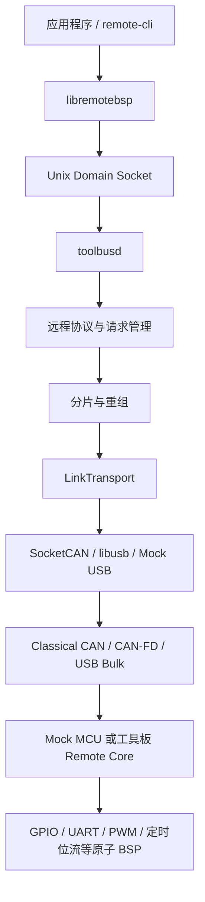

# Remote BSP

RemoteBSP 是受 Klipper 主机/MCU 分工启发、面向通用机电设备重新设计的分布式
控制平台。Linux 主机默认通过 CAN/CAN-FD，也可通过 USB Vendor Bulk 管理 MCU
工具板，并像使用本地资源一样调用远端 GPIO、UART、PWM 和智能运动等能力。
传感器、Modbus、阀门、运动规划和厂商协议运行在 Linux；MCU 固件只执行原子、
确定性的硬件操作与必要的本地安全策略。

RemoteBSP 不兼容 Klipper 协议，也不提供完整打印控制栈。它把“Linux 规划、MCU
实时执行”的架构扩展到通用资源、多节点 CAN/CAN-FD、故障隔离、静态固件生成和
可观测性。产品定位与类似 Moonraker + Fluidd 的后续上位机配套边界见
[产品定位与上位机配套架构](docs/product-positioning-and-host-stack.md)。

当前代码已经打通 Linux 主机、Mock MCU、Classical CAN、CAN-FD 和第一版 USB
Vendor Bulk 主机/Mock/G431 Device 链路，并完成
STM32F103 实板链路。STM32F103 的 CAN/USB 双模式 Katapult Bootloader 已完成
实体板下载验证；STM32G431 已完成 CAN-FD 发现、心跳、PING、信息查询和 GPIO
实板验证。STM32F072/FLY-D5 与 G431 双模式 Bootloader 的模式切换仍待实板验收。

## 架构



应用程序不得直接访问 SocketCAN。`toolbusd` 独占总线管理职责，包括节点发现、
心跳、请求超时与重试、响应匹配、分片重组、事件分发和本地 IPC。

## 配置与固件生成原则

RemoteBSP Studio 是目标产品的正式配置入口。GUI 保存版本化工程，完成资源冲突
校验并生成完整 Kconfig `.config`；Kconfig 同时表达底层硬件、功能裁剪、静态预算
和具体资源映射。终端 `menuconfig` 只作为开发、CI 和无 GUI 环境的备用入口。

GPIO、UART、STEP/DIR/EN/DIAG、TMC、PWM 和 WS2812 映射均编译进板卡专用 APP，
烧录并重启后固定生效。运行期间可以控制资源状态，但不能动态申请 IO 或改变引脚
复用。SN、UUID、制造信息和 ADC 校准值使用独立 EEPROM/Flash 仿 EEPROM 参数区，
不保存 IO 拓扑。详细设计见
[固件配置与 RemoteBSP Studio 设计](docs/configuration-and-studio.md)。

## 当前能力

| 模块 | 当前状态 |
|---|---|
| 远程包协议 | 版本、消息类型、命令、会话 ID、请求 ID、对象 ID、长度、标志、CRC，小端编码 |
| 分片层 | Classical CAN 8 字节、CAN-FD 64 字节，最大包 2048 字节，超时、重复和非法分片检查 |
| 通用链路层 | `LinkTransport`、逻辑路由号和链路能力；SocketCAN、libusb 与 Mock USB 共用 Remote Packet |
| USB Vendor Bulk | Linux libusb、Mock USB 全链路及 G431 USB Device Vendor Bulk 后端已实现；G431 实体枚举与压力测试待验收 |
| 节点管理 | UUID 发现、节点分配、500 ms 心跳、2 s 离线判定 |
| 请求管理 | 超时、重试、响应匹配、重复请求缓存，避免副作用重复执行 |
| CAN流量控制 | Classical CAN/CAN-FD线时间估算、六类业务预算、发送前准入和统计查询 |
| 静态资源配置 | Studio 工程生成完整 Kconfig `.config`；固件启动时建立固定资源表，严格检查引脚方向、共享 EN、TMC 引用、端点和容量，不提供在线改线 |
| 设备参数 | SN、UUID、硬件版本、制造批次/日期、设备名称与 ADC 校准值；双页 Flash 仿 EEPROM、CRC、代数和掉电安全提交，协议与介质解耦 |
| 远程资源 | GPIO、UART、PWM、通用定时位流、STEPGEN 运动轴、I2C/SPI 总线与设备合同、资源枚举、健康状态、复位和会话级租约 |
| 总线与高速流 | I2C/SPI 原子事务、设备级 NACK/超时/忙/故障结果、主机 API 和 Mock 已实现；Stream 合同、打开、数据、信用和状态编解码已实现，实体 BSP 与流会话待实现 |
| 智能步进 Mock | 板卡能力决定的多轴 STEP/DIR/EN 时间线、有界队列、绝对/自动排程、欠载/限位安全停机和状态遥测；TimeSync 已接入 toolbusd 有界周期采样，已补充 512 段持续多轴与同步生命周期回归 |
| Mock MCU | 版本化板卡描述、Classical CAN/CAN-FD、多节点、GPIO、UART、PWM、定时位流、I2C/SPI 原子事务和运动执行，并可导出数字孪生状态 |
| RemoteBSP Studio | 本地中文 GUI 首版：板卡资源工程、冲突过滤、I2C/SPI 图形编辑、Mock 数字孪生、稳定 schema/迁移、`.config` 生成、32线程构建和产物归档；可生成确定性中文接线表、资源摘要、稳定清单与校验文件。总线工程明确限制为 Mock；GUI 自动烧录/回读尚未实现 |
| STM32F103CBT6 / WeAct BluePill Plus | 外部8 MHz HSE、32.768 kHz LSE资源保留、Classical CAN、GPIO、USART1/2/3、双模式Katapult；三路115200全双工并发各方向1024字节已实板逐字节验证，0错字/0丢失；PA6 PWM、PA8 DMA定时位流及五轴/TMC后端已交叉编译 |
| STM32F072RBT6 / Mellow FLY-D5 | Classical CAN 1 Mbit/s、GPIO、五轴运动与五路 TMC2209 通讯已实板验证；PA6 TIM3_CH1 PWM 与 PA8 TIM1_CH1+DMA 定时位流已交叉编译；双模式 Katapult 切换待验收 |
| STM32G431CBU6 / WeAct STM32G431CBU6 Core | 外部 8 MHz HSE、32.768 kHz LSE 资源保留、CAN-FD 500 kbit/s + 1 Mbit/s BRS、USART1/2/3、PC6 TIM3_CH1 PWM、PA8 TIM1_CH1+DMA 定时位流、PC13 GPIO；CAN-FD、板载 PWM、单轴运动、三路115200全双工并发及 Studio 专用固件资源校验均已实板验证，实体 WS2812 波形待验收 |

I2C/SPI 已完成线协议、`libremotebsp` API、资源合同、严格编解码、Mock BSP、
设备级故障隔离，以及 Studio 静态端点/合同图形编辑和前后端一致校验；含总线资源的
工程当前只能驱动 Mock，实体 `.config`/固件生成会明确拒绝。实体 STM32 BSP、有界物理
总线队列与遥测尚未实现。高速 Stream 当前只完成合同和信用流控协议骨架，尚无运行时会话。
ADC、通用 Timer 和 Storage 仍按当前优先级后置。
通用 PWM 与定时位流已经完成协议、Linux API/CLI、Mock、数字孪生、GUI 草案和
F072/F103/G431 固件后端第一阶段。PWM 直接描述频率、万分比占空比和极性；
定时位流只描述 0/1 高低时间与复位时间，WS2812 的 RGB/GRB 排列、亮度和动画
仍由 Linux 处理。三块板均已交叉编译，但新 DMA 波形后端尚未使用示波器和实体
灯带验收，不能视为硬件完成。正式 APP 默认仍运行 CAN/CAN-FD；G431 另有互斥的
USB Vendor Bulk APP 预设，主机、Mock、MCU 公共帧格式和 G431 Device 后端已完成
交叉编译，待实体枚举与压力测试。Katapult USB 应急升级保持独立 PID，不作为
APP 调试串口。

当前主线优先级为智能步进运动、数字孪生、遥测与监控、图形配置器。Mock 已实现
第一版多轴运动段协议和确定性执行器；Linux 通过 `libremotebsp`/CLI 入队，MCU
独立生成 STEP/DIR/EN 时间线，不逐脉冲占用 CAN。F072/F103/G431 已从固定 tick
切换为 TIM2_CH1 compare 边沿调度，支持单轴/整板步频准入、独立脉宽、不可整除
DDA 余数分配和迟到安全停机。G431 已用 Studio 专用固件完成 100 STEP 空载调度
实测；STEP 上升沿仍严格执行迟到停机，下降沿和纯段结束允许安全延后，避免因
拉长脉宽或推迟关闭 EN 被误判为多发脉冲。持续高步频和示波器抖动验收仍待实现。
跨板时钟同步已经完成 `TimeSync v1` 协议、确定性 Mock BSP、四时间戳主机闭环、启动代次
校验和 `toolbusd` 有界周期调度；首帧发送与完整响应边界均显式锁存时间，离线、重启和
最终超时会清理同步状态。实体计数器 BSP、硬件时间戳质量验证和跨板
PREPARE/READY/COMMIT 仍待实现。

具体 GPIO、UART、运动、TMC、PWM 和定时位流映射由 Studio 生成到 Kconfig，构建为
静态资源表。TMC2209 单线端点固定为 40000 bit/s，帧、CRC 和寄存器语义仍由 Linux
负责。生成器会检查引脚、共享 EN、轴—驱动绑定、PWM 定时器以及定时位流的
定时器/DMA冲突。实体 STM32 的完整复用图仍需补齐。

设备参数是独立机制：F103 在末尾保留 2 KiB，F072/G431 保留 4 KiB，采用双页
Flash 仿 EEPROM 保存身份、制造和校准数据。Katapult 已限制 APP 写入上界，因此
在线升级不会覆盖参数区。Studio 构建归档已经实现，烧录、回读和设备参数维护页面尚待实现。

## 目录

```text
protocol/       远程包、CRC、资源描述和分片协议
device_params/  MCU无关的设备参数schema与掉电安全快照存储
transport/      通用链路接口、SocketCAN、libusb、USB 帧格式和 Mock USB
toolbusd/       Linux 守护进程、本地 IPC、发现、心跳和请求管理
libremotebsp/   C++ 应用客户端
mock_mcu/       Linux Mock MCU 与模拟 BSP
boards/         版本化板卡描述、公开资源和内部占用关系
firmware/       STM32 Remote Core、板级 BSP、Katapult 配置和构建脚本
gui/            本地板卡配置器与 Mock 数字孪生可视化
tests/          单元、端到端、vcan 和实体 CAN 测试
docs/           架构、硬件、构建、升级和 API 文档
```

生成物不属于源码结构：主机默认构建到 `build-wsl/`，STM32 按目标构建到
`firmware/build/<目标>/`，最终固件复制到 `firmware/out/`。下载的 STM32 HAL/CMSIS
依赖位于 `firmware/vendor/`，硬件备份位于 `hardware-backups/`；这些目录均被 Git
忽略。正式板卡配置与临时验收配置的边界见
[固件正式配置](firmware/configs/README.md)和
[固件验收配置](firmware/tests/configs/README.md)。

## Linux 主机构建

需要 Linux 或具备 SocketCAN/vcan 的 WSL2，以及 CMake 3.16、Ninja、C++17
编译器、can-utils、pkg-config 和 libusb。项目开发使用的 WSL 发行版名为 `Ubuntu`。

```sh
sudo apt update
sudo apt install -y build-essential cmake ninja-build can-utils \
    pkg-config libusb-1.0-0-dev

cd /mnt/d/Documents/RemoteBSP
cmake -S . -B build-wsl -G Ninja \
    -DBUILD_TESTING=ON \
    -DREMOTEBSP_VCAN_INTERFACE=vcan0
cmake --build build-wsl --parallel 32
```

准备 vcan 并运行测试：

```sh
sudo modprobe vcan
sudo ip link add dev vcan0 type vcan 2>/dev/null || true
sudo ip link set dev vcan0 up

ctest --test-dir build-wsl --output-on-failure
```

自动测试覆盖协议、CRC、设备参数 schema/存储/远程调用、运动与波形线格式、分片、
CAN/CAN-FD帧、SocketCAN、USB帧、固件USB编解码和USB Mock端到端链路，以及发现、
心跳、多节点、超时与去重、GPIO、UART、I2C/SPI资源合同与Mock故障隔离、资源租约、
数字孪生、主机时钟模型、运动欠载/限位停机、PWM/定时位流/WS2812、CAN-FD BRS、
流量准入、Kconfig生成、Studio总线图形编辑到Mock清单的黄金路径、TimeSync v1
四时间戳闭环、GUI API，以及默认使用版本化 `remote-cli --json` 的只读 Runtime API。
Runtime Provider 另提供 250 ms 单飞短缓存、资源状态有界并发和 HTTP 活动请求上限；
失败不会回退陈旧快照，新鲜度通过响应字段和响应头显式给出。
配置入口、静态映射边界、设备参数与Studio构建/烧录目标见
[固件配置与 RemoteBSP Studio 设计](docs/configuration-and-studio.md)。

Mock和启用设备参数模块的STM32支持以下参数维护命令：

```sh
./build-wsl/remote-cli --node 1 param-status
./build-wsl/remote-cli --node 1 param-list
./build-wsl/remote-cli --node 1 param-get serial-number
./build-wsl/remote-cli --node 1 param-set serial-number RBSP-000001
# 12字节：gain_q16_16=1.0、offset_uv=0、reference_uv=3300000，小端编码。
./build-wsl/remote-cli --node 1 param-set adc0 hex:0000010000000000a05a3200
```

参数区不保存IO映射。资源接线修改请在Studio中重新生成`.config`并烧录专用固件。

## 快速运行完整模拟链路

打开三个终端。

终端一启动 Mock MCU：

```sh
cd /mnt/d/Documents/RemoteBSP
./build-wsl/mock_mcu/mock_mcu vcan0 classical
```

终端二启动 `toolbusd`：

```sh
cd /mnt/d/Documents/RemoteBSP
./build-wsl/toolbusd/toolbusd vcan0 classical /tmp/toolbusd.sock
```

终端三通过本地 IPC 操作节点：

```sh
cd /mnt/d/Documents/RemoteBSP
./build-wsl/remote-cli node-list
./build-wsl/remote-cli --node 1 ping hello
./build-wsl/remote-cli --node 1 get-info
./build-wsl/remote-cli --node 1 get-capability
./build-wsl/remote-cli traffic-status
./build-wsl/remote-cli --node 1 resource-list
./build-wsl/remote-cli --node 1 resource-contract 0x0100000d

# Mock阶段可以先取得GPIO 13的5秒独占租约，命令会返回lease_id。
./build-wsl/remote-cli --node 1 resource-acquire \
    0x0100000d 5000 exclusive

./build-wsl/remote-cli --node 1 gpio-create 13 output 0
./build-wsl/remote-cli --node 1 gpio-write 1 1
./build-wsl/remote-cli --node 1 gpio-read 1

./build-wsl/remote-cli --node 1 uart-create 0 115200 8 none 1
./build-wsl/remote-cli --node 1 uart-write 2 hello
./build-wsl/remote-cli --node 1 uart-read 2 64

# GPS等持续输入使用流式对象；对象ID以实际返回值为准。
./build-wsl/remote-cli --node 1 uart-create 1 115200 8 none 1 stream
./build-wsl/remote-cli --node 1 uart-stream-read 3 1024 1000
./build-wsl/remote-cli --node 1 uart-write-all 3 long-message 3000

# PWM：20 kHz、42%占空比，高电平有效；对象ID以实际返回值为准。
./build-wsl/remote-cli --node 1 pwm-create 0 20000 4200 active-high
./build-wsl/remote-cli --node 1 pwm-write 4 7500
./build-wsl/remote-cli --node 1 pwm-stop 4

# WS2812：Linux 将RGB像素转换为GRB位流，MCU只负责按时序输出。
./build-wsl/remote-cli --node 1 ws2812-create 0
./build-wsl/remote-cli --node 1 ws2812-write 5 FF000000FF000000FF

# 运动轴要求独占租约。默认 Mock 示例的三路资源 ID 如下。
./build-wsl/remote-cli --node 1 resource-acquire 0x09000000 5000 exclusive
./build-wsl/remote-cli --node 1 resource-acquire 0x09000001 5000 exclusive
./build-wsl/remote-cli --node 1 resource-acquire 0x09000002 5000 exclusive

# 自动选择开始时间，1 ms 内让 X 走 +3 步、Y 走 -2 步、Z 不动。
./build-wsl/remote-cli --node 1 motion-contract
./build-wsl/remote-cli --node 1 motion-enqueue \
    1 auto 1000000 final \
    0x09000000:3 0x09000001:-2 0x09000002:0
./build-wsl/remote-cli --node 1 motion-status
```

`motion-contract`返回活动轴列表、每轴最大步频与STEP时序、整板总步频、队列容量和
最小排程提前量。`libremotebsp`会缓存该静态合同，并在发送运动段前使用整数算法
执行轴集合、单轴步频、脉宽/低电平以及整板总步频准入；不满足时请求不会进入
`toolbusd`或CAN总线。资源映射只随固件更新改变，节点重新发现后客户端会重建合同缓存。

CAN-FD 模式下把 Mock MCU 和 `toolbusd` 命令中的 `classical` 都改为 `fd`。
可使用不同 `--instance 1..127` 同时启动多个 Mock 工具板。增加
`--uart-stream` 后，Mock MCU 会保留逻辑UART 7的兼容事件，并向已经创建为
`stream`模式的UART 0～3注入测试字节，供CLI和C++流式接口端到端验证。

Mock 默认从 [统一板卡描述](boards/mock-generic-v1.json) 加载板型、UUID 模板、
能力、资源、能力合同和内部占用关系。可用 `--board <JSON>` 加载其他描述，
用 `--fault-scenario <JSON>` 注入单 UART 故障、GPIO 输入、运动限位或节点
离线/恢复。
格式与验证规则见
[统一板卡描述与数字孪生 Mock](docs/board-manifest-and-digital-twin.md)。

## 图形配置器与数字孪生

第一版 RemoteBSP Studio 不需要安装前端依赖，直接在 Ubuntu WSL 中运行：

```sh
cd /mnt/d/Documents/RemoteBSP
python3 gui/server.py
```

浏览器访问 `http://127.0.0.1:8765`。未连接 Mock 时页面使用内置演示数据；要显示
Mock MCU 的真实 GPIO、步进位置、运动队列和故障状态，可这样启动：

```sh
./build-wsl/mock_mcu/mock_mcu vcan0 classical \
    --visual-state /tmp/remotebsp-mock-state.json
python3 gui/server.py --state /tmp/remotebsp-mock-state.json
```

数字孪生的运动区域为每个轴显示独立步进电机、当前位置步数和角度指针；状态数据
未声明每转步数时，预览按 200 step/rev 映射一圈，不改变运动内核的真实位置。
波形区域同时显示 PWM 频率、占空比、运行状态和 WS2812 逻辑像素颜色。

引脚配置页从与固件 Kconfig 同源的板卡引脚目录生成选项，按 GPIOA/GPIOB/GPIOC
分组，并隐藏 SWD、CAN、Katapult USB、板载演示资源和已被其他字段选中的引脚。
EN 可以保持独立，也可以显式复用前面任意轴的 EN；共享组继承同一有效极性，
固件会合并各轴使能请求，最后一个轴释放后才关闭物理 EN。
每个轴还可以独立设置 DIR 正常或反相，改变设备定义的机械正方向不需要重新接线。
数字 IO 编辑器可设置逻辑名称、输入/输出、内部上下拉、有效电平、输出故障安全
电平和输入消抖；板载按键等已知接口由板卡描述锁定原理图确定的属性。
普通 UART 编辑器从板卡目录选择整组硬件端点并设置固定波特率，RX/TX引脚只读联动，
仍会和运动、GPIO、PWM及灯带进行统一冲突检查。BluePill Plus与WeAct G431均提供USART1的
PA9/PA10默认端点及PB6/PB7备选端点、USART2的PA2/PA3、USART3的PB10/PB11；
三路按UART 0→1→2连续裁剪。TMC2209的40000 bit/s单线UART保持为独立
资源，不会混入这里。RS-485 DE/RE方向引脚尚未实现。
PWM 与 WS2812 使用两个独立配置区，可以分别增加或删除多个资源。每个资源先选择
绑定定时器/通道/引脚/DMA的硬件端点预设，已实现与待验证端点会明确区分。PWM配置只保存
端点、固定频率、默认占空比和极性；灯带配置保存位流端点、灯珠数量、
色序和复位时间。GPO电平、PWM启停/实时占空比和灯带颜色集中在独立“实时控制”页，
目前只操作本地预览。所有配置参与同一套引脚冲突检查，可导出JSON工程并生成完整
Kconfig `.config`。GUI可直接使用32个并行任务构建，并下载Studio工程、配置、
ELF/BIN/HEX/MAP、日志和带SHA-256的构建记录；该路径已在F072/FLY-D5、
F103/BluePill Plus和G431/WeAct Core上真实交叉编译。烧录与回读尚未接入。
设备身份、制造信息和ADC校准值走独立参数接口，不混入IO工程。详细用法见
[RemoteBSP Studio](gui/README.md)。

`toolbusd`默认按当前实测基线估算发送方向线时间：Classical CAN为
1 Mbit/s，CAN-FD为500 kbit/s仲裁段和1 Mbit/s数据段。CAN-FD发送已显式启用
BRS。实际接口速率不同必须在启动时声明：

```sh
./build-wsl/toolbusd/toolbusd can0 fd /tmp/toolbusd.sock \
    --arbitration-bitrate 500000 \
    --data-bitrate 1000000 \
    --max-utilization-permille 700 \
    --burst-window-ms 250
```

`traffic-status`显示准入、拒绝、保证发送、估算帧数和六类业务统计。当前为发送
前准入第一阶段，尚未实现可抢占优先级队列和每资源独立配额。

广播发现和节点分配使用 CAN ID `0x700`。分配后，节点 N 使用 `0x600 + N`
接收请求、`0x580 + N` 返回响应、`0x500 + N` 发送事件和心跳。

## STM32 固件与 Katapult

在 Ubuntu WSL 中安装交叉编译器并构建依赖、Bootloader、APP 和工厂镜像：

```sh
sudo apt install -y gcc-arm-none-eabi

cd /mnt/d/Documents/RemoteBSP/firmware
bash scripts/fetch_stm32_deps.sh
bash scripts/fetch_katapult.sh
bash scripts/build_bootloader.sh all
bash scripts/build_firmware.sh f072
bash scripts/build_firmware.sh mellow-fly-d5-katapult
bash scripts/build_firmware.sh weact-bluepill-plus-katapult
bash scripts/build_firmware.sh weact-stm32g431cbu6-core-katapult
bash scripts/build_factory_images.sh
```

主要输出位于 `firmware/out`：

- `katapult-stm32f072_mellow_fly_d5_dual.bin`
- `katapult-stm32f103_weact_bluepill_plus_dual.bin`
- `katapult-stm32g431_weact_core_dual.bin`
- `remotebsp-*-katapult.bin`：供 Katapult 在线更新的 APP
- `remotebsp-*-katapult-dual-factory.bin`：供 ST-Link 首次烧录的完整镜像

APP 从 `0x08002000` 开始，前 8 KiB 保留给 Katapult。构建产物和实体板 Flash
备份不会提交到 Git。

FLY-D5 的引脚、构建、烧录和当前能力边界见
[Mellow FLY-D5 支持说明](docs/mellow-fly-d5.md)。
F072采用“MCU通用层+板型配置”结构；新增其他STM32F072RBT6板卡时复用
`boards/stm32f072rbt6`，只增加板型选择、默认配置、保留引脚和机器可读板卡描述。

### 双模式升级

正常情况下通过 CAN 进入并升级：

```sh
./build-wsl/remote-cli --node 1 bootloader-enter
python3 firmware/vendor/katapult/scripts/flashtool.py -i can0 -q
```

设备原生 USB 已连接但不方便操作按键时，可以通过 CAN 命令切换到 USB：

```sh
./build-wsl/remote-cli --node 1 bootloader-enter-usb
python3 firmware/vendor/katapult/scripts/flashtool.py \
    -d /dev/serial/by-id/<Katapult设备> \
    -f firmware/out/remotebsp-stm32f103-bluepill-katapult.bin
```

CAN 已完全失效时，WeAct BluePill Plus 按住 PA0、WeAct STM32G431CBU6 Core 按住 PC13 并
复位，也会进入 USB Katapult。F103 实板已经验证：

- CAN Katapult UUID：`70fa76b1eae9`
- USB 枚举：`1d50:6177`
- CAN 和 USB 均完成 APP 写入、SHA 校验、复位和节点恢复
- 从 USB 升级后的 APP 可以再次切换到 CAN Katapult

单节点总线进入 USB Katapult 后，如果没有其他 CAN 节点为发现帧提供 ACK，
部分 gs_usb 适配器可能进入 ERROR-PASSIVE。当前可以重启 `can0` 恢复；
`toolbusd` 的总线状态监测和自动恢复仍待增强。

当前主机适配器基线为：CANable2 硬件刷入 CANable2.5 的 Candlelight/`gs_usb`
固件。它直接枚举为 SocketCAN `canX`，不使用 `slcand`；接口配置、CAN-FD
能力检查和恢复步骤见 [STM32 构建、烧录与总线适配器说明](docs/stm32-build-and-flash.md)。

## 文档

- [文档导航与当前状态](docs/README.md)
- [项目待办](TODO.md)
- [架构与设计说明](docs/architecture.md)
- [使用场景与需求](docs/use-cases-and-requirements.md)
- [产品定位与上位机配套架构](docs/product-positioning-and-host-stack.md)
- [Studio 与上位机运行时边界](docs/studio-runtime-design.md)
- [总线设备与高速流资源设计](docs/bus-and-stream-resources.md)
- [运动可靠性与跨板同步验证计划](docs/motion-reliability-plan.md)
- [主机时钟同步模型](docs/clock-synchronization.md)
- [只读 Runtime API](docs/runtime-api.md)
- [智能实时资源与多轴运动控制设计](docs/intelligent-motion-resources.md)
- [libremotebsp 客户端 API](docs/libremotebsp-api.md)
- [STM32 硬件与接线](docs/stm32-hardware-plan.md)
- [Mellow FLY-D5 板卡说明](docs/mellow-fly-d5.md)
- [WeAct BluePill Plus 板卡说明](docs/weact-bluepill-plus.md)
- [WeAct STM32G431CBU6 Core 板卡说明](docs/weact-stm32g431cbu6-core.md)
- [STM32 固件编译与烧录](docs/stm32-build-and-flash.md)
- [Katapult 双模式升级与应急恢复](docs/bootloader-upgrade.md)
- [USB Vendor Bulk 传输](docs/usb-transport.md)
- [RemoteBSP Studio 图形配置器](gui/README.md)

## 项目边界

当前阶段不包含 Linux 内核驱动、STM32 之外的 MCU、以太网传输或设备专用
传感器/阀门驱动。Remote BSP 协议层不依赖 SocketCAN，MCU Remote Core 不包含
设备协议，应用程序也不能绕过 `toolbusd` 直接访问 CAN 或 USB。USB 的 Linux
主机与 Mock 链路已经实现，STM32 USB Device 业务后端仍属于后续实板工作。
