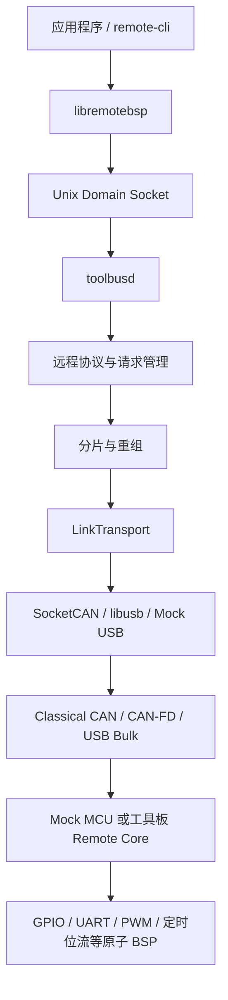

# Remote BSP

RemoteBSP 是受 Klipper 主机/MCU 分工启发、面向通用机电设备重新设计的分布式
控制平台。Linux 主机默认通过 CAN/CAN-FD，也可通过 USB Vendor Bulk 管理 MCU
工具板，并像使用本地资源一样调用远端 GPIO、UART、PWM 和智能运动等能力。
传感器、Modbus、阀门、运动规划和厂商协议运行在 Linux；MCU 固件只执行原子、
确定性的硬件操作与必要的本地安全策略。

RemoteBSP 不兼容 Klipper 协议，也不提供完整打印控制栈。它把“Linux 规划、MCU
实时执行”的架构扩展到通用资源、多节点 CAN/CAN-FD、故障隔离、静态固件生成和
可观测性。产品定位与类似 Moonraker + Fluidd 的后续上位机配套边界见
[产品定位与上位机配套架构](docs/product-positioning-and-host-stack.md)。

当前代码已经打通 Linux 主机、Mock MCU、Classical CAN、CAN-FD 和第一版 USB
Vendor Bulk 主机/Mock/G431 Device 链路，并完成
STM32F103 实板链路。STM32F103 的 CAN/USB 双模式 Katapult Bootloader 已完成
实体板下载验证；STM32G431 已完成 CAN-FD 发现、心跳、PING、信息/能力查询、压力与
重启恢复，并在真机发现并修复资源枚举缺口后贯通 5 项静态资源到 RuntimeSnapshot。
STM32F072/FLY-D5 与 G431 双模式 Bootloader 的模式切换仍待实板验收。

当前迭代明确排除需要多块实体板共同验证的跨板卡场景；已有跨板设计与纯软件证据
继续保留，但不会由单板或 Mock 结果外推关闭。其余单板固件、Studio、运行时、总线、
设备参数和可靠性能力继续推进。

## 架构



应用程序不得直接访问 SocketCAN。`toolbusd` 独占总线管理职责，包括节点发现、
心跳、请求超时与重试、响应匹配、分片重组、事件分发和本地 IPC。

## 配置与固件生成原则

RemoteBSP Studio 是目标产品的正式配置入口。GUI 保存版本化工程，完成资源冲突
校验并生成完整 Kconfig `.config`；Kconfig 同时表达底层硬件、功能裁剪、静态预算
和具体资源映射。终端 `menuconfig` 只作为开发、CI 和无 GUI 环境的备用入口。

GPIO、UART、STEP/DIR/EN/DIAG、TMC、PWM 和 WS2812 映射均编译进板卡专用 APP，
烧录并重启后固定生效。运行期间可以控制资源状态，但不能动态申请 IO 或改变引脚
复用。SN、UUID、制造信息和 ADC 校准值使用独立 EEPROM/Flash 仿 EEPROM 参数区，
不保存 IO 拓扑。详细设计见
[固件配置与 RemoteBSP Studio 设计](docs/configuration-and-studio.md)。

## 当前能力

| 模块 | 当前状态 |
|---|---|
| 远程包协议 | 版本、消息类型、命令、会话 ID、请求 ID、对象 ID、长度、标志、CRC，小端编码 |
| 分片层 | Classical CAN 8 字节、CAN-FD 64 字节，最大包 2048 字节，超时、重复和非法分片检查 |
| 通用链路层 | `LinkTransport`、逻辑路由号和链路能力；SocketCAN、libusb 与 Mock USB 共用 Remote Packet |
| USB Vendor Bulk | Linux libusb、Mock USB 全链路及 G431 USB Device Vendor Bulk 后端已实现；G431 实体枚举与压力测试待验收 |
| 节点管理 | UUID 发现、节点分配、500 ms 心跳、2 s 离线判定 |
| 请求管理 | 超时、重试、响应匹配、重复请求缓存，避免副作用重复执行 |
| CAN流量控制 | Classical CAN/CAN-FD线时间估算、六类业务预算、发送前准入和统计查询 |
| 静态资源配置 | Studio 工程生成完整 Kconfig `.config` 和 GPIO/UART/PWM/定时位流只读静态表；三板在编译期校验 schema、板型、资源数量与端点符号，并用同一表完成启动校验和运行时白名单，不提供在线改线 |
| 设备参数 | SN、UUID、硬件版本、制造批次/日期、设备名称与 ADC 校准值；双页 Flash 仿 EEPROM、CRC、代数和掉电安全提交，协议与介质解耦。Studio Web 已提供只读快照和带 SHA-256 完整性校验的 v2 备份，恢复兼容 v1；显式 CLI 写入与恢复通过 UUID、generation CAS 和固定确认短语防止写错节点或覆盖并发变化；尚未完成实体参数区掉电验收 |
| 远程资源 | GPIO、UART、PWM、通用定时位流、STEPGEN 运动轴、I2C/SPI 总线与设备合同、资源枚举、健康状态接口、复位和会话级租约；G431 已接入 UART 真实环形缓冲水位/溢出以及 PWM/TimedBitstream 忙和后端失败基础状态；公共 Core 的 `ResourceReset` 已恢复兼容语义：UART 清缓冲/故障并释放对象、PWM 安全停止、TimedBitstream 中止，后端失败则保留对象和故障状态以便重试 |
| 总线与高速流 | I2C/SPI 原子事务、主机/Mock、`toolbusd` 合同缓存与父总线仲裁、STM32 公共 Core，以及 G431 I2C1/SPI1/SPI2 实体 HAL 已实现并交叉编译；生产板级代码另由主机 HAL 桩覆盖 I2C flags、统一超时预算、可选恢复、SPI 片选和失败恢复。总线测试固件仍未烧录，亦未连接从设备或完成电气/时序实测。H2N/N2H Mock Stream 已覆盖租约、序号、精确 ACK 信用、两阶段交付、背压和会话清理；双向 Stream 与真实高速数据面待实现 |
| 智能步进与跨板事务 | 板卡能力决定的多轴 STEP/DIR/EN 时间线、有界队列和安全停机；跨板事务已接入 `toolbusd`、IPC/API/CLI 和 STM32 公共 Remote Core，固件 STEPGEN 静态独占租约覆盖普通运动与组事务，并在释放、过期或会话结束时安全停机；三款实体板因尚无可靠 `boot_epoch` 来源而安全禁用跨板入口 |
| Mock MCU | 版本化板卡描述、Classical CAN/CAN-FD、多节点、GPIO、UART、PWM、定时位流、I2C/SPI、H2N/N2H Stream 和运动执行；故障脚本及逻辑 LinkTransport 会话可有界录制并确定性回放双向帧、失败、空结果、delay/drop/duplicate/reboot，文件固定标注为逻辑证据，不冒充真实 CAN/USB 物理层 |
| RemoteBSP Studio | 本地中文 GUI 首版：板卡资源工程、冲突过滤、I2C/SPI 图形编辑、Mock 数字孪生、工程差异、`.config` 与静态表生成、32线程构建和产物归档已实现。非交互 CLI 的 `deploy-stlink` 可执行受保护产物的写入/校验/复位，完整核验后生成自哈希部署记录，并可严格关联生产记录与批次。独立版本化 `FirmwareIdentity` 命令已贯通 MCU、Mock、`libremotebsp`、`toolbusd` CLI 与 Studio；Studio 构建向固件注入工程、配置和固件输入三项 SHA-256，非 Studio 固件逐字段报告 unavailable；Mock USB 已覆盖真实进程重启与缓存失效。只读 `inspect-runtime-identity` 仍不能单独记作实体烧录闭环 |
| Runtime API | HTTP v1、RuntimeSnapshot IPC v2、短缓存、故障隔离、时钟质量告警和增量事件已实现；认证回环 HTTP 已把细粒度 `runtime.gpio.write` 权限、短时租约、稳定 UUID、节点代次和幂等键映射到 `toolbusd` GPIO IPC v2。首次创建保持低电平，释放、过期和关停执行安全写低及 `GPIO_CLOSE`，Close 不确定会冻结单资源直至幂等重试确认，成功后同代可安全复用；固件对象和会话清理也强制所有权隔离。GPIO 写入/释放操作现由 `toolbusd` 持久操作账本记录 pending 与终态，可按 operation ID 或严格 selector 跨租约 TTL 查询，重启恢复的 unknown 会冻结对应资源；Runtime HTTP 已贯通查询、定位和不确定结果自动恢复。控制/健康 IPC 错误信封 v1 与请求级单调绝对期限已贯通，并强制“可能已提交即不可直接重试”；`ControlAuditJournal` 已用同步 intent/terminal/unknown、HMAC-SHA256 链、分段容量和失败关闭覆盖租约与 GPIO 控制，16 项日志内核及 6 项 HTTP 集成测试已通过。USB Mock、vcan Classical CAN 与 CAN-FD 软件验证已覆盖。TLS、主动推送、跨重启事件历史和实体失效安全时延验证仍待实现 |
| 遥测健康契约 | `HealthSnapshot v1` 已定义稳定来源、生产者代际、节点、时间基、状态、单位及有界指标；严格区分可用零值、未知、不可用和未报告。toolbusd 软件生产者、公共 MCU/Mock Remote Core 应答、`libremotebsp`、CLI 与 Runtime 可信投影器已贯通；公共 MCU Core 可投影真实 HAL CPU/ISR/栈样本及自身运动队列、租约、故障和 uptime。实体板尚无可靠的跨重启生产者代际与 CPU/ISR/栈采样后端，因此不会伪报实体数据 |
| 成熟度证据 | `RemoteBSP Maturity v1` 机器可读基线与严格验证器已建立；另有 RemoteBSP/Klipper 公平对照计划与运行记录验证器，强制版本/配置锁定、至少30次样本、三次独立运行、原始文件哈希和安全失败否决。计划仍是 draft、整体结论仍 blocked，不把 Mock、交叉编译或局部实测外推成全面超过 Klipper |
| STM32F103CBT6 / WeAct BluePill Plus | 外部8 MHz HSE、32.768 kHz LSE资源保留、Classical CAN、GPIO、USART1/2/3、双模式Katapult；三路115200全双工并发各方向1024字节已实板逐字节验证，0错字/0丢失；PA6 PWM、PA8 DMA定时位流及五轴/TMC后端已交叉编译 |
| STM32F072RBT6 / Mellow FLY-D5 | Classical CAN 1 Mbit/s、GPIO、五轴运动与五路 TMC2209 通讯已实板验证；PA6 TIM3_CH1 PWM 与 PA8 TIM1_CH1+DMA 定时位流已交叉编译；双模式 Katapult 切换待验收 |
| STM32G431CBU6 / WeAct STM32G431CBU6 Core | 外部 8 MHz HSE、32.768 kHz LSE 资源保留、CAN-FD 500 kbit/s + 1 Mbit/s BRS、USART1/2/3、PC6 TIM3_CH1 PWM、PA8 TIM1_CH1+DMA 定时位流、PC13 GPIO；CAN-FD、板载 PWM、单轴运动、三路115200全双工并发及 Studio 专用固件资源校验均已实板验证。2026-09-10 真机压力 200/200、4×50 并发全过，2023 字节分片 56 ms，daemon/MCU/CAN 接口恢复通过；修复后枚举 3 UART、PWM0、TimedBitstream0 并由 RuntimeSnapshot 返回。PA6/D5 已采集 1 kHz/50%、1 kHz/12.34%、100 kHz/50% 和 100 kHz/25%，各 0 毛刺；修复 `pwm-stop` 对象释放后，实体状态由 Busy 回到 Normal、对象 1 无复位重建为对象 2，并再次通过 100 kHz/25%。I2C1 PB6/PB7、SPI1 PA5/PA6/PA7+PA15 CS、SPI2 PB13/PB14/PB15+PB12 CS 实体 HAL 已交叉编译，但未烧录或电气实测；SPI1 占用当前 DL16 D5 所接 PA6，保持该接线时不得烧录总线测试固件。PA0/PA4 仍需复测，不能外推 STEP、TimedBitstream 或跨板时序 |

I2C/SPI 已完成线协议、`libremotebsp` API、资源合同、严格编解码、Mock BSP、
设备级故障隔离、Studio 静态端点/合同图形编辑、`toolbusd` 合同懒加载与父总线
非阻塞仲裁，以及默认关闭的 STM32 公共
Remote Core/HAL 骨架。嵌入式切片把端点、长度、超时、flags、独占租约与同步原子
事务边界固定下来；合同首访单飞、节点代次失效和跨节点/跨总线隔离已有软件测试。
设备持有独占租约期间，公共 Core 的 `ResourceStatus` 会报告 Busy，释放、超时或会话
清理后恢复 Normal；这只证明设备级租约状态映射。G431 已增加默认关闭的 I2C1/
SPI1/SPI2 板级 HAL 和专用交叉编译配置；同一份生产代码已在主机 HAL 桩中覆盖 flags、
统一超时预算、恢复分支和 SPI 片选，但仍未烧录、未接从设备、未完成电气与时序实测；
F072/F103 仍无板级总线 HAL。高速 Stream 已完成
H2N/N2H Mock 会话状态机；N2H 使用 peek/commit 两阶段
交付，编码、分片、后端或租约失败时不提前消费数据。双向、USB Bulk 和 Ethernet
真实数据面仍未实现。
ADC、通用 Timer 和 Storage 仍按当前优先级后置。
通用 PWM 与定时位流已经完成协议、Linux API/CLI、Mock、数字孪生、GUI 草案和
F072/F103/G431 固件后端第一阶段。PWM 直接描述频率、万分比占空比和极性；
定时位流只描述 0/1 高低时间与复位时间，WS2812 的 RGB/GRB 排列、亮度和动画
仍由 Linux 处理。三块板均已交叉编译，但新 DMA 波形后端尚未使用示波器和实体
灯带验收，不能视为硬件完成。正式 APP 默认仍运行 CAN/CAN-FD；G431 另有互斥的
USB Vendor Bulk APP 预设，主机、Mock、MCU 公共帧格式和 G431 Device 后端已完成
交叉编译，待实体枚举与压力测试。Katapult USB 应急升级保持独立 PID，不作为
APP 调试串口。

当前主线优先级为智能步进运动、数字孪生、遥测与监控、图形配置器。Mock 已实现
第一版多轴运动段协议和确定性执行器；Linux 通过 `libremotebsp`/CLI 入队，MCU
独立生成 STEP/DIR/EN 时间线，不逐脉冲占用 CAN。F072/F103/G431 已从固定 tick
切换为 TIM2_CH1 compare 边沿调度，支持单轴/整板步频准入、独立脉宽、不可整除
DDA 余数分配和迟到安全停机。G431 已用 Studio 专用固件完成 100 STEP 空载调度
实测；STEP 上升沿仍严格执行迟到停机，下降沿和纯段结束允许安全延后，避免因
拉长脉宽或推迟关闭 EN 被误判为多发脉冲。持续高步频和示波器抖动验收仍待实现。
跨板时钟同步已经完成 `TimeSync v1` 协议、确定性 Mock BSP、四时间戳主机闭环、启动代次
校验和 `toolbusd` 有界周期调度；首帧发送与完整响应边界均显式锁存时间，离线、重启和
最终超时会清理同步状态。跨板运动事务已增加版本化 PREPARE/READY/COMMIT/ABORT
线格式、冻结时钟模型与节点 tick 的主机协调器，以及幂等参与者 Mock。参与者现已
接入 Mock Remote Core 和实际 Mock 运动队列，覆盖租约与普通停止的安全失效；独立
运动组服务已把协调器接入 RequestManager、`toolbusd` 主循环、版本化本地 IPC、
`libremotebsp` 和 CLI。双节点 Mock USB 进程级回归验证了全员 READY 后才 COMMIT、
短连接提交者退出不取消事务，以及显式取消在 COMMIT 前触发全组 ABORT；直接绕过
事务 IPC 向单节点发送运动组命令会被守护进程拒绝。COMMIT 后的 ABORT 只保证尽力
停止，不能声称物理回滚。STM32 公共 Remote Core 已实现可选参与者、完成水位、旧事务
防重放和调度失败安全停机，并完成 F072/F103/G431 交叉编译；三款板当前故意不提供
`motion_boot_epoch()`，因此普通单板运动可用而 TimeSync/运动组明确返回不支持。通用
双页 boot epoch Flash journal 已通过掉电截断、页轮换、CRC、回绕和快速复位故障注入，
但尚未为板卡划分独立保留区或验证升级保留/实体 Flash 行为。实体跨板同步仍是开放
前置条件。固件侧 STEPGEN 已实现 100～60000 ms
静态独占租约，普通入队与运动组都要求同一会话覆盖段内全部轴；释放、过期、会话结束
或复位会清除状态并进入安全停机，但其实体最坏停机延迟仍待统一测量。

具体 GPIO、UART、运动、TMC、PWM 和定时位流映射由 Studio 生成到 Kconfig，构建为
静态资源表。TMC2209 单线端点固定为 40000 bit/s，帧、CRC 和寄存器语义仍由 Linux
负责。生成器会检查引脚、共享 EN、轴—驱动绑定、PWM 定时器以及定时位流的
定时器/DMA冲突。实体 STM32 的完整复用图仍需补齐。

设备参数是独立机制：F103 在末尾保留 2 KiB，F072/G431 保留 4 KiB，采用双页
Flash 仿 EEPROM 保存身份、制造和校准数据。Katapult 已限制 APP 写入上界，因此
在线升级不会覆盖参数区。Studio Web 已接入只读参数快照和备份；写入及恢复只通过显式
CLI 执行，并在每次修改前核对节点 UUID、参数 generation 和固定维护确认短语。Studio
构建归档、部署作业软件模块、显式 ST-Link CLI 与运行时固件身份读取适配器已实现；
网页部署/参数写入界面、实体烧录后自动核验和参数区掉电实测仍未完成。

## 目录

```text
protocol/       远程包、CRC、资源描述和分片协议
device_params/  MCU无关的设备参数schema与掉电安全快照存储
transport/      通用链路接口、SocketCAN、libusb、USB 帧格式和 Mock USB
toolbusd/       Linux 守护进程、本地 IPC、发现、心跳和请求管理
libremotebsp/   C++ 应用客户端
mock_mcu/       Linux Mock MCU 与模拟 BSP
boards/         版本化板卡描述、公开资源和内部占用关系
firmware/       STM32 Remote Core、板级 BSP、Katapult 配置和构建脚本
gui/            本地板卡配置器与 Mock 数字孪生可视化
tests/          单元、端到端、vcan 和实体 CAN 测试
docs/           架构、硬件、构建、升级和 API 文档
maturity/       机器可读成熟度基线、Schema、验证器和证据口径
```

生成物不属于源码结构：主机默认构建到 `build-wsl/`，STM32 按目标构建到
`firmware/build/<目标>/`，最终固件复制到 `firmware/out/`。下载的 STM32 HAL/CMSIS
依赖位于 `firmware/vendor/`，硬件备份位于 `hardware-backups/`；这些目录均被 Git
忽略。正式板卡配置与临时验收配置的边界见
[固件正式配置](firmware/configs/README.md)和
[固件验收配置](firmware/tests/configs/README.md)。

## Linux 主机构建

需要 Linux 或具备 SocketCAN/vcan 的 WSL2，以及 CMake 3.16、Ninja、C++17
编译器、can-utils、pkg-config 和 libusb。项目开发使用的 WSL 发行版名为 `Ubuntu`。

```sh
sudo apt update
sudo apt install -y build-essential cmake ninja-build can-utils \
    pkg-config libusb-1.0-0-dev

cd /mnt/d/Documents/RemoteBSP
cmake -S . -B build-wsl -G Ninja \
    -DBUILD_TESTING=ON \
    -DREMOTEBSP_VCAN_INTERFACE=vcan0
cmake --build build-wsl --parallel 32
```

准备 vcan 并运行测试：

```sh
sudo modprobe vcan
sudo ip link add dev vcan0 type vcan 2>/dev/null || true
sudo ip link set dev vcan0 up

ctest --test-dir build-wsl --output-on-failure
```

自动测试覆盖协议、CRC、设备参数 schema/存储/远程调用、运动与波形线格式、分片、
CAN/CAN-FD帧、SocketCAN、USB帧、固件USB编解码和USB Mock端到端链路，以及发现、
心跳、多节点、超时与去重、GPIO、UART、I2C/SPI资源合同与Mock故障隔离、资源租约、
数字孪生、主机时钟模型、运动欠载/限位停机、PWM/定时位流/WS2812、CAN-FD BRS、
流量准入、Kconfig生成、Studio总线图形编辑到Mock清单的黄金路径、TimeSync v1
四时间戳闭环、跨板事务纯软件状态机和双节点进程级闭环、GUI API，以及默认使用版本化
`remote-cli --json` 的 Runtime 读取 API，以及认证回环 HTTP 到 `toolbusd` 的 GPIO
最小控制闭环。Runtime 已通过单次本地 IPC 快照消除一次刷新
中的 N+1 进程与套接字连接，并保留拓扑稳定校验、资源/节点故障隔离和显式旧文本兼容；
Provider 另提供 250 ms 单飞短缓存和 HTTP 活动请求上限，失败不会回退陈旧快照；
缓存有效期还会受时钟样本陈旧阈值约束，不能跨过阈值继续返回无告警旧结果。
RuntimeSnapshot IPC 已升级到 v2，把每个节点的启动代次、模型代次、同步状态、样本数、
漂移及误差估计贯通到 Runtime API；Runtime 会按可配置误差与样本年龄阈值输出稳定
质量告警，旧文本源只标记观测能力未知。这些是软件模型观测值，不代表硬件已达到相同精度。
toolbusd 另通过独立版本化只读 IPC 生产 `HealthSnapshot v1`，把 daemon instance ID 与随机
非零生产者代际原子返回；认证 Runtime 健康接口严格校验来源、序号、时间和指标语义，公开
存活探针不读取 Provider。该快照仅报告 toolbusd 可证明的软件状态，不冒充 MCU 或物理链路测量。
Runtime 的认证授权已包含 API key 身份、`runtime.read`、`runtime.gpio.write` 及控制租约
申请/释放/撤销权限：
密钥以固定长度摘要比较；普通 REST 审计使用脱敏请求 ID、有界环形缓冲和非阻塞输出。
控制变更另要求显式配置 `ControlAuditJournal(directory, key_file)`，命令行通过
`--control-audit-dir` 与 `--control-audit-key-file` 成对传入。它在任何下游副作用前同步
intent，在成功响应前同步 terminal，结果不可证明时记录 unknown；HMAC-SHA256 链、签名
manifest、目录/文件权限、单链接和独占锁校验会在启动时失败关闭控制入口。控制租约仅在
回环监听且启用认证时开放，按节点+资源排他并有 100～30000 ms TTL、终态幂等保护和请求
读取期限。`gpio.write` 租约会以剩余 TTL、稳定节点 UUID、当前节点代次和幂等键登记到
`toolbusd` IPC v2；守护进程在实际写入前再次核对当前节点注册表和静态 GPIO 合同。
GPIO 写入和释放现先持久化 pending，再执行目标 I/O，并在返回成功前持久化终态；
`remote-cli` 与 Runtime HTTP 可在本地租约 TTL 结束后继续查询 operation，无法证明结果时
返回 `unknown`/`expired_unknown` 并冻结或要求协调，绝不把未知当成可直接重试。控制审计
负责操作者证据，operation ledger 仍是结果与恢复的权威；普通读取审计仍是进程内记录。
这仍不提供链路加密、无限期历史、可信时间、不可否认性或对同机 root 的防护。增量事件采用带进程
实例标识的严格游标、有界分页和过期重同步，
只表示成功快照之间的差分，不是 WebSocket，也不能捕获两次轮询间出现后又恢复的瞬态。
非回环部署仍必须由受控 TLS 反向代理、密钥文件权限和限速补齐。
`toolbusd` 本地控制套接字固定为 `0660`，拒绝删除其他用户的同名对象，并在退出时按
device/inode 核对后清理。

GitHub 的“软件基线验证”工作流会在主分支、`codex/**` 分支和合并请求上重复执行
Ubuntu 主机/Mock/vcan 全量测试、成熟度门禁与三类 STM32 正式配置交叉编译，并保留
JUnit 与固件产物 30 天。该结果属于自动测试和交叉编译证据，不能替代实体板验证。
2026-09-10 的 G431 实体轮次另完成 CAN-FD 压力、恢复和资源枚举闭环；同轮 72/72
主机测试及六目标交叉编译仍按软件证据记录。DL16 已在关闭官方上位机后通过
`atk-logic` 取得 PA6 的 1 kHz/50%、1 kHz/12.34%、100 kHz/50% 和 100 kHz/25%
原始采集，全部 0 毛刺；最终生命周期修复固件再次通过 100 kHz/25%。同轮还实板确认
`pwm-stop` 后资源从 Busy 回到 Normal，并可不复位由对象 1 重建为对象 2。此前
`incomplete` 仅发生在 PA0/PA4，不能泛化到所有高电平通道。公共 GND 仍待用户口头确认，
且这些单路 PWM 不能替代 STEP、TimedBitstream 或跨板时序验收。
完整边界见 [G431 CAN-FD 实体验收记录](docs/hardware-evidence-g431-2026-09-10.md)。
配置入口、静态映射边界、设备参数与Studio构建/烧录目标见
[固件配置与 RemoteBSP Studio 设计](docs/configuration-and-studio.md)。

Mock和启用设备参数模块的STM32支持以下参数维护命令：

```sh
./build-wsl/remote-cli --node 1 param-status
./build-wsl/remote-cli --node 1 param-list
./build-wsl/remote-cli --node 1 param-get serial-number
./build-wsl/remote-cli --node 1 param-set serial-number RBSP-000001
# 12字节：gain_q16_16=1.0、offset_uv=0、reference_uv=3300000，小端编码。
./build-wsl/remote-cli --node 1 param-set adc0 hex:0000010000000000a05a3200
```

参数区不保存IO映射。资源接线修改请在Studio中重新生成`.config`并烧录专用固件。

## 快速运行完整模拟链路

打开三个终端。

终端一启动 Mock MCU：

```sh
cd /mnt/d/Documents/RemoteBSP
./build-wsl/mock_mcu/mock_mcu vcan0 classical
```

终端二启动 `toolbusd`：

```sh
cd /mnt/d/Documents/RemoteBSP
./build-wsl/toolbusd/toolbusd vcan0 classical /tmp/toolbusd.sock \
    --runtime-operation-ledger-dir /tmp/remotebsp-operation-ledger
```

终端三通过本地 IPC 操作节点：

```sh
cd /mnt/d/Documents/RemoteBSP
./build-wsl/remote-cli node-list
./build-wsl/remote-cli --node 1 ping hello
./build-wsl/remote-cli --node 1 get-info
./build-wsl/remote-cli --node 1 get-capability
./build-wsl/remote-cli traffic-status
./build-wsl/remote-cli --node 1 resource-list
./build-wsl/remote-cli --node 1 resource-contract 0x0100000d

# Mock阶段可以先取得GPIO 13的5秒独占租约，命令会返回lease_id。
./build-wsl/remote-cli --node 1 resource-acquire \
    0x0100000d 5000 exclusive

./build-wsl/remote-cli --node 1 gpio-create 13 output 0
./build-wsl/remote-cli --node 1 gpio-write 1 1
./build-wsl/remote-cli --node 1 gpio-read 1

./build-wsl/remote-cli --node 1 uart-create 0 115200 8 none 1
./build-wsl/remote-cli --node 1 uart-write 2 hello
./build-wsl/remote-cli --node 1 uart-read 2 64

# GPS等持续输入使用流式对象；对象ID以实际返回值为准。
./build-wsl/remote-cli --node 1 uart-create 1 115200 8 none 1 stream
./build-wsl/remote-cli --node 1 uart-stream-read 3 1024 1000
./build-wsl/remote-cli --node 1 uart-write-all 3 long-message 3000

# PWM：20 kHz、42%占空比，高电平有效；对象ID以实际返回值为准。
./build-wsl/remote-cli --node 1 pwm-create 0 20000 4200 active-high
./build-wsl/remote-cli --node 1 pwm-write 4 7500
./build-wsl/remote-cli --node 1 pwm-stop 4

# WS2812：Linux 将RGB像素转换为GRB位流，MCU只负责按时序输出。
./build-wsl/remote-cli --node 1 ws2812-create 0
./build-wsl/remote-cli --node 1 ws2812-write 5 FF000000FF000000FF

# 运动轴要求独占租约。默认 Mock 示例的三路资源 ID 如下。
./build-wsl/remote-cli --node 1 resource-acquire 0x09000000 5000 exclusive
./build-wsl/remote-cli --node 1 resource-acquire 0x09000001 5000 exclusive
./build-wsl/remote-cli --node 1 resource-acquire 0x09000002 5000 exclusive

# 自动选择开始时间，1 ms 内让 X 走 +3 步、Y 走 -2 步、Z 不动。
./build-wsl/remote-cli --node 1 motion-contract
./build-wsl/remote-cli --node 1 motion-enqueue \
    1 auto 1000000 final \
    0x09000000:3 0x09000001:-2 0x09000002:0
./build-wsl/remote-cli --node 1 motion-status
```

`motion-contract`返回活动轴列表、每轴最大步频与STEP时序、整板总步频、队列容量和
最小排程提前量。`libremotebsp`会缓存该静态合同，并在发送运动段前使用整数算法
执行轴集合、单轴步频、脉宽/低电平以及整板总步频准入；不满足时请求不会进入
`toolbusd`或CAN总线。资源映射只随固件更新改变，节点重新发现后客户端会重建合同缓存。

CAN-FD 模式下把 Mock MCU 和 `toolbusd` 命令中的 `classical` 都改为 `fd`。
可使用不同 `--instance 1..127` 同时启动多个 Mock 工具板。增加
`--uart-stream` 后，Mock MCU 会保留逻辑UART 7的兼容事件，并向已经创建为
`stream`模式的UART 0～3注入测试字节，供CLI和C++流式接口端到端验证。

Mock 默认从 [统一板卡描述](boards/mock-generic-v1.json) 加载板型、UUID 模板、
能力、资源、能力合同和内部占用关系。可用 `--board <JSON>` 加载其他描述，
用 `--fault-scenario <JSON>` 注入单 UART 故障、GPIO 输入、运动限位或节点
离线/恢复。
格式与验证规则见
[统一板卡描述与数字孪生 Mock](docs/board-manifest-and-digital-twin.md)。

## 图形配置器与数字孪生

第一版 RemoteBSP Studio 不需要安装前端依赖，直接在 Ubuntu WSL 中运行：

```sh
cd /mnt/d/Documents/RemoteBSP
python3 gui/server.py
```

浏览器访问 `http://127.0.0.1:8765`。未连接 Mock 时页面使用内置演示数据；要显示
Mock MCU 的真实 GPIO、步进位置、运动队列和故障状态，可这样启动：

```sh
./build-wsl/mock_mcu/mock_mcu vcan0 classical \
    --visual-state /tmp/remotebsp-mock-state.json
python3 gui/server.py --state /tmp/remotebsp-mock-state.json
```

数字孪生的运动区域为每个轴显示独立步进电机、当前位置步数和角度指针；状态数据
未声明每转步数时，预览按 200 step/rev 映射一圈，不改变运动内核的真实位置。
波形区域同时显示 PWM 频率、占空比、运行状态和 WS2812 逻辑像素颜色。

引脚配置页从与固件 Kconfig 同源的板卡引脚目录生成选项，按 GPIOA/GPIOB/GPIOC
分组，并隐藏 SWD、CAN、Katapult USB、板载演示资源和已被其他字段选中的引脚。
EN 可以保持独立，也可以显式复用前面任意轴的 EN；共享组继承同一有效极性，
固件会合并各轴使能请求，最后一个轴释放后才关闭物理 EN。
每个轴还可以独立设置 DIR 正常或反相，改变设备定义的机械正方向不需要重新接线。
数字 IO 编辑器可设置逻辑名称、输入/输出、内部上下拉、有效电平、输出故障安全
电平和输入消抖；板载按键等已知接口由板卡描述锁定原理图确定的属性。
普通 UART 编辑器从板卡目录选择整组硬件端点并设置固定波特率，RX/TX引脚只读联动，
仍会和运动、GPIO、PWM及灯带进行统一冲突检查。BluePill Plus与WeAct G431均提供USART1的
PA9/PA10默认端点及PB6/PB7备选端点、USART2的PA2/PA3、USART3的PB10/PB11；
三路按UART 0→1→2连续裁剪。TMC2209的40000 bit/s单线UART保持为独立
资源，不会混入这里。RS-485 DE/RE方向引脚尚未实现。
PWM 与 WS2812 使用两个独立配置区，可以分别增加或删除多个资源。每个资源先选择
绑定定时器/通道/引脚/DMA的硬件端点预设，已实现与待验证端点会明确区分。PWM配置只保存
端点、固定频率、默认占空比和极性；灯带配置保存位流端点、灯珠数量、
色序和复位时间。GPO电平、PWM启停/实时占空比和灯带颜色集中在独立“实时控制”页，
目前只操作本地预览。所有配置参与同一套引脚冲突检查，可导出JSON工程并生成完整
Kconfig `.config`。GUI可直接使用32个并行任务构建，并下载Studio工程、配置、
ELF/BIN/HEX/MAP、日志和带SHA-256的构建记录；该路径已在F072/FLY-D5、
F103/BluePill Plus和G431/WeAct Core上真实交叉编译。命令行现可显式执行
`deploy-stlink`；网页入口和真实运行时身份读取器尚未接入，不能视为完整自动回读。
设备身份、制造信息和ADC校准值走独立参数接口，不混入IO工程。详细用法见
[RemoteBSP Studio](gui/README.md)。

`toolbusd`默认按当前实测基线估算发送方向线时间：Classical CAN为
1 Mbit/s，CAN-FD为500 kbit/s仲裁段和1 Mbit/s数据段。CAN-FD发送已显式启用
BRS。实际接口速率不同必须在启动时声明：

```sh
./build-wsl/toolbusd/toolbusd can0 fd /tmp/toolbusd.sock \
    --arbitration-bitrate 500000 \
    --data-bitrate 1000000 \
    --max-utilization-permille 700 \
    --burst-window-ms 250 \
    --runtime-operation-ledger-dir /var/lib/remotebsp/operation-ledger
```

`--runtime-operation-ledger-dir` 是强制参数。生产目录应由 `toolbusd` 专用服务用户独占并
持久保存；不要把 `/tmp` 示例路径用于正式部署，也不要在重启时清空账本来绕过资源阻断。

`traffic-status`显示准入、拒绝、保证发送、估算帧数和六类业务统计。当前为发送
前准入第一阶段，尚未实现可抢占优先级队列和每资源独立配额。

广播发现和节点分配使用 CAN ID `0x700`。分配后，节点 N 使用 `0x600 + N`
接收请求、`0x580 + N` 返回响应、`0x500 + N` 发送事件和心跳。

## STM32 固件与 Katapult

在 Ubuntu WSL 中安装交叉编译器并构建依赖、Bootloader、APP 和工厂镜像：

```sh
sudo apt install -y gcc-arm-none-eabi

cd /mnt/d/Documents/RemoteBSP/firmware
bash scripts/fetch_stm32_deps.sh
bash scripts/fetch_katapult.sh
bash scripts/build_bootloader.sh all
bash scripts/build_firmware.sh f072
bash scripts/build_firmware.sh mellow-fly-d5-katapult
bash scripts/build_firmware.sh weact-bluepill-plus-katapult
bash scripts/build_firmware.sh weact-stm32g431cbu6-core-katapult
bash scripts/build_factory_images.sh
```

主要输出位于 `firmware/out`：

- `katapult-stm32f072_mellow_fly_d5_dual.bin`
- `katapult-stm32f103_weact_bluepill_plus_dual.bin`
- `katapult-stm32g431_weact_core_dual.bin`
- `remotebsp-*-katapult.bin`：供 Katapult 在线更新的 APP
- `remotebsp-*-katapult-dual-factory.bin`：供 ST-Link 首次烧录的完整镜像

APP 从 `0x08002000` 开始，前 8 KiB 保留给 Katapult。构建产物和实体板 Flash
备份不会提交到 Git。

FLY-D5 的引脚、构建、烧录和当前能力边界见
[Mellow FLY-D5 支持说明](docs/mellow-fly-d5.md)。
F072采用“MCU通用层+板型配置”结构；新增其他STM32F072RBT6板卡时复用
`boards/stm32f072rbt6`，只增加板型选择、默认配置、保留引脚和机器可读板卡描述。

### 双模式升级

正常情况下通过 CAN 进入并升级：

```sh
./build-wsl/remote-cli --node 1 bootloader-enter
python3 firmware/vendor/katapult/scripts/flashtool.py -i can0 -q
```

设备原生 USB 已连接但不方便操作按键时，可以通过 CAN 命令切换到 USB：

```sh
./build-wsl/remote-cli --node 1 bootloader-enter-usb
python3 firmware/vendor/katapult/scripts/flashtool.py \
    -d /dev/serial/by-id/<Katapult设备> \
    -f firmware/out/remotebsp-stm32f103-bluepill-katapult.bin
```

CAN 已完全失效时，WeAct BluePill Plus 按住 PA0、WeAct STM32G431CBU6 Core 按住 PC13 并
复位，也会进入 USB Katapult。F103 实板已经验证：

- CAN Katapult UUID：`70fa76b1eae9`
- USB 枚举：`1d50:6177`
- CAN 和 USB 均完成 APP 写入、SHA 校验、复位和节点恢复
- 从 USB 升级后的 APP 可以再次切换到 CAN Katapult

单节点总线进入 USB Katapult 后，如果没有其他 CAN 节点为发现帧提供 ACK，
部分 gs_usb 适配器可能进入 ERROR-PASSIVE。当前可以重启 `can0` 恢复；
`toolbusd` 的总线状态监测和自动恢复仍待增强。

当前主机适配器基线为：CANable2 硬件刷入 CANable2.5 的 Candlelight/`gs_usb`
固件。它直接枚举为 SocketCAN `canX`，不使用 `slcand`；接口配置、CAN-FD
能力检查和恢复步骤见 [STM32 构建、烧录与总线适配器说明](docs/stm32-build-and-flash.md)。

## 文档

- [文档导航与当前状态](docs/README.md)
- [项目待办](TODO.md)
- [架构与设计说明](docs/architecture.md)
- [使用场景与需求](docs/use-cases-and-requirements.md)
- [产品定位与上位机配套架构](docs/product-positioning-and-host-stack.md)
- [Studio 与上位机运行时边界](docs/studio-runtime-design.md)
- [总线设备与高速流资源设计](docs/bus-and-stream-resources.md)
- [运动可靠性与跨板同步验证计划](docs/motion-reliability-plan.md)
- [主机时钟同步模型](docs/clock-synchronization.md)
- [Runtime API](docs/runtime-api.md)
- [Runtime 到 toolbusd 的 GPIO 写控制边界](docs/runtime-gpio-control.md)
- [Runtime 不确定提交恢复与操作结果账本](docs/runtime-operation-ledger.md)
- [遥测与健康契约](docs/telemetry-health-contract.md)
- [智能实时资源与多轴运动控制设计](docs/intelligent-motion-resources.md)
- [libremotebsp 客户端 API](docs/libremotebsp-api.md)
- [STM32 硬件与接线](docs/stm32-hardware-plan.md)
- [Mellow FLY-D5 板卡说明](docs/mellow-fly-d5.md)
- [WeAct BluePill Plus 板卡说明](docs/weact-bluepill-plus.md)
- [WeAct STM32G431CBU6 Core 板卡说明](docs/weact-stm32g431cbu6-core.md)
- [2026-09-10 G431 CAN-FD 实体验收记录](docs/hardware-evidence-g431-2026-09-10.md)
- [STM32 固件编译与烧录](docs/stm32-build-and-flash.md)
- [Katapult 双模式升级与应急恢复](docs/bootloader-upgrade.md)
- [USB Vendor Bulk 传输](docs/usb-transport.md)
- [RemoteBSP Studio 图形配置器](gui/README.md)

## 项目边界

当前阶段不包含 Linux 内核驱动、STM32 之外的 MCU、以太网传输或设备专用
传感器/阀门驱动。Remote BSP 协议层不依赖 SocketCAN，MCU Remote Core 不包含
设备协议，应用程序也不能绕过 `toolbusd` 直接访问 CAN 或 USB。USB 的 Linux
主机与 Mock 链路已经实现，STM32 USB Device 业务后端仍属于后续实板工作。
