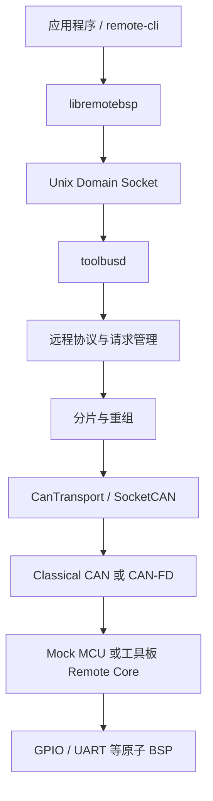

# Remote BSP

Remote BSP 是一个传输无关的远程板级支持框架。Linux 主机通过 CAN/CAN-FD
统一管理多块 MCU 工具板，并像使用本地资源一样调用远端 GPIO、UART 等通用
硬件能力。传感器、Modbus、阀门和厂商协议全部运行在 Linux；MCU 固件只执行
原子硬件操作，不包含设备专用驱动。

当前代码已经打通 Linux 主机、Mock MCU、Classical CAN、CAN-FD 和
STM32F103 实板链路。STM32F103 的 CAN/USB 双模式 Katapult Bootloader 已完成
实体板下载验证；STM32G431 固件和双模式 Bootloader 已交叉编译，等待实板验收。

## 架构



应用程序不得直接访问 SocketCAN。`toolbusd` 独占总线管理职责，包括节点发现、
心跳、请求超时与重试、响应匹配、分片重组、事件分发和本地 IPC。

## 当前能力

| 模块 | 当前状态 |
|---|---|
| 远程包协议 | 版本、消息类型、命令、会话 ID、请求 ID、对象 ID、长度、标志、CRC，小端编码 |
| 分片层 | Classical CAN 8 字节、CAN-FD 64 字节，最大包 2048 字节，超时、重复和非法分片检查 |
| 节点管理 | UUID 发现、节点分配、500 ms 心跳、2 s 离线判定 |
| 请求管理 | 超时、重试、响应匹配、重复请求缓存，避免副作用重复执行 |
| 远程资源 | GPIO、UART、资源枚举、描述、健康状态和复位 |
| Mock MCU | Classical CAN/CAN-FD、多节点、16 路 GPIO、8 路 UART、UART RX 事件 |
| STM32F103CBT6 | Classical CAN、GPIO、USART1、双模式 Katapult；实板已验证 |
| STM32G431CBU6 | CAN-FD、GPIO、USB CDC 调试、双模式 Katapult；等待实板验证 |

SPI、I2C、ADC、PWM、Timer 和 Storage 属于后续资源类型，当前尚未实现。USB
目前只用于 Katapult 恢复升级和 G431 APP 调试输出，不是 RemoteBSP 业务传输。

下一阶段已经形成智能实时资源设计：Linux 负责多轴轨迹和 TMC 协议，MCU
负责定时 STEP/DIR/EN、前瞻队列、本地限位联锁和通用 UART/SPI 事务。引脚与
资源依赖使用可持久化的运行时资源清单，`menuconfig` 只保留固定硬件参数和
功能裁剪。不同板卡通过主机校准各自时钟，预装运动段后按同一个未来绝对时间
启动；当前仅完成设计，尚未并入稳定协议和实体固件。

## 目录

```text
protocol/       远程包、CRC、资源描述和分片协议
transport/      与协议无关的 CAN 传输接口和 SocketCAN 实现
toolbusd/       Linux 守护进程、本地 IPC、发现、心跳和请求管理
libremotebsp/   C++ 应用客户端
mock_mcu/       Linux Mock MCU 与模拟 BSP
firmware/       STM32 Remote Core、板级 BSP、Katapult 配置和构建脚本
tests/          单元、端到端、vcan 和实体 CAN 测试
docs/           架构、硬件、构建、升级和 API 文档
```

## Linux 主机构建

需要 Linux 或具备 SocketCAN/vcan 的 WSL2，以及 CMake 3.16、Ninja、C++17
编译器和 can-utils。项目开发使用的 WSL 发行版名为 `Ubuntu`。

```sh
sudo apt update
sudo apt install -y build-essential cmake ninja-build can-utils

cd /mnt/d/Documents/RemoteBSP
cmake -S . -B build-wsl -G Ninja \
    -DBUILD_TESTING=ON \
    -DREMOTEBSP_VCAN_INTERFACE=vcan0
cmake --build build-wsl
```

准备 vcan 并运行测试：

```sh
sudo modprobe vcan
sudo ip link add dev vcan0 type vcan 2>/dev/null || true
sudo ip link set dev vcan0 up

ctest --test-dir build-wsl --output-on-failure
```

当前自动测试共 16 项，覆盖协议、CRC、分片、CAN/CAN-FD 帧、SocketCAN、
发现、心跳、多节点、请求超时与去重、GPIO、UART、资源模型和嵌入式 Remote
Core。

## 快速运行完整模拟链路

打开三个终端。

终端一启动 Mock MCU：

```sh
cd /mnt/d/Documents/RemoteBSP
./build-wsl/mock_mcu/mock_mcu vcan0 classical
```

终端二启动 `toolbusd`：

```sh
cd /mnt/d/Documents/RemoteBSP
./build-wsl/toolbusd/toolbusd vcan0 classical /tmp/toolbusd.sock
```

终端三通过本地 IPC 操作节点：

```sh
cd /mnt/d/Documents/RemoteBSP
./build-wsl/remote-cli node-list
./build-wsl/remote-cli --node 1 ping hello
./build-wsl/remote-cli --node 1 get-info
./build-wsl/remote-cli --node 1 get-capability
./build-wsl/remote-cli --node 1 resource-list

./build-wsl/remote-cli --node 1 gpio-create 13 output 0
./build-wsl/remote-cli --node 1 gpio-write 1 1
./build-wsl/remote-cli --node 1 gpio-read 1

./build-wsl/remote-cli --node 1 uart-create 0 115200 8 none 1
./build-wsl/remote-cli --node 1 uart-write 2 hello
./build-wsl/remote-cli --node 1 uart-read 2 64
```

CAN-FD 模式下把 Mock MCU 和 `toolbusd` 命令中的 `classical` 都改为 `fd`。
可使用不同 `--instance 1..127` 同时启动多个 Mock 工具板。增加
`--uart-stream` 后，Mock MCU 会从逻辑 UART 7 周期发送 RX 事件。

广播发现和节点分配使用 CAN ID `0x700`。分配后，节点 N 使用 `0x600 + N`
接收请求、`0x580 + N` 返回响应、`0x500 + N` 发送事件和心跳。

## STM32 固件与 Katapult

在 Ubuntu WSL 中安装交叉编译器并构建依赖、Bootloader、APP 和工厂镜像：

```sh
sudo apt install -y gcc-arm-none-eabi

cd /mnt/d/Documents/RemoteBSP/firmware
bash scripts/fetch_stm32_deps.sh
bash scripts/fetch_katapult.sh
bash scripts/build_bootloader.sh all
bash scripts/build_firmware.sh bluepill-katapult
bash scripts/build_firmware.sh g431-katapult
bash scripts/build_factory_images.sh
```

主要输出位于 `firmware/out`：

- `katapult-stm32f103_dual.bin`
- `katapult-stm32g431_dual.bin`
- `remotebsp-*-katapult.bin`：供 Katapult 在线更新的 APP
- `remotebsp-*-katapult-dual-factory.bin`：供 ST-Link 首次烧录的完整镜像

APP 从 `0x08002000` 开始，前 8 KiB 保留给 Katapult。构建产物和实体板 Flash
备份不会提交到 Git。

### 双模式升级

正常情况下通过 CAN 进入并升级：

```sh
./build-wsl/remote-cli --node 1 bootloader-enter
python3 firmware/vendor/katapult/scripts/flashtool.py -i can0 -q
```

设备原生 USB 已连接但不方便操作按键时，可以通过 CAN 命令切换到 USB：

```sh
./build-wsl/remote-cli --node 1 bootloader-enter-usb
python3 firmware/vendor/katapult/scripts/flashtool.py \
    -d /dev/serial/by-id/<Katapult设备> \
    -f firmware/out/remotebsp-stm32f103-bluepill-katapult.bin
```

CAN 已完全失效时，按住 PA0 并复位也会进入 USB Katapult。F103 实板已经验证：

- CAN Katapult UUID：`70fa76b1eae9`
- USB 枚举：`1d50:6177`
- CAN 和 USB 均完成 APP 写入、SHA 校验、复位和节点恢复
- 从 USB 升级后的 APP 可以再次切换到 CAN Katapult

单节点总线进入 USB Katapult 后，如果没有其他 CAN 节点为发现帧提供 ACK，
部分 gs_usb 适配器可能进入 ERROR-PASSIVE。当前可以重启 `can0` 恢复；
`toolbusd` 的总线状态监测和自动恢复仍待增强。

## 文档

- [项目概览与当前状态](docs/project-overview.md)
- [项目待办](TODO.md)
- [架构与设计说明](docs/architecture.md)
- [使用场景与需求](docs/use-cases-and-requirements.md)
- [智能实时资源与多轴运动控制设计](docs/intelligent-motion-resources.md)
- [libremotebsp 客户端 API](docs/libremotebsp-api.md)
- [STM32 硬件与接线](docs/stm32-hardware-plan.md)
- [STM32 固件编译与烧录](docs/stm32-build-and-flash.md)
- [Katapult Bootloader 与 USB 调试](docs/bootloader-and-usb-debug.md)

## 项目边界

当前阶段不包含 Linux 内核驱动、STM32 之外的 MCU、以太网传输或设备专用
传感器/阀门驱动。Remote BSP 协议层不依赖 SocketCAN，MCU Remote Core 不包含
设备协议，应用程序也不能绕过 `toolbusd` 直接访问 CAN。
