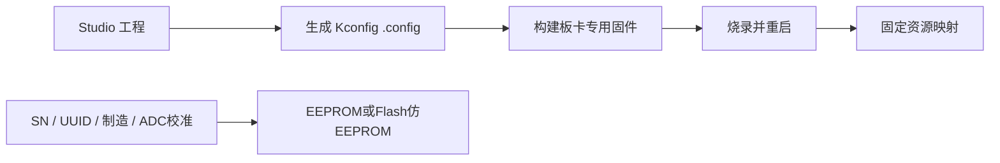

# Remote BSP 文档导航与项目状态

> 最后整理：2026-09-10

## 文档导航

- [系统分层与通信设计](architecture.md)
- [固件配置与 RemoteBSP Studio](configuration-and-studio.md)
- [智能运动与资源模型](intelligent-motion-resources.md)
- [板卡描述与数字孪生](board-manifest-and-digital-twin.md)
- [数字孪生确定性记录与回放](digital-twin-replay.md)
- [STM32 构建、烧录与验证](stm32-build-and-flash.md)
- [Katapult 双模式升级与应急恢复](bootloader-upgrade.md)
- [USB Vendor Bulk 传输](usb-transport.md)
- [Mellow FLY-D5](mellow-fly-d5.md)
- [WeAct BluePill Plus](weact-bluepill-plus.md)
- [WeAct STM32G431CBU6 Core](weact-stm32g431cbu6-core.md)
- [客户端 API](libremotebsp-api.md)
- [使用场景与需求](use-cases-and-requirements.md)
- [产品定位与上位机配套架构](product-positioning-and-host-stack.md)
- [Studio 与上位机运行时边界](studio-runtime-design.md)
- [总线设备与高速流资源设计](bus-and-stream-resources.md)
- [运动可靠性与跨板同步验证计划](motion-reliability-plan.md)
- [主机时钟同步模型](clock-synchronization.md)
- [STM32 跨板运动组参与者](embedded-motion-groups.md)
- [可靠启动代次 Flash 日志](motion-boot-epoch-journal.md)
- [Runtime API](runtime-api.md)
- [Runtime 到 toolbusd 的 GPIO 写控制边界](runtime-gpio-control.md)
- [遥测与健康契约](telemetry-health-contract.md)
- [安全威胁模型](security-threat-model.md)
- [可审计成熟度基线](../maturity/README.md)
- [RemoteBSP / Klipper 可复现对照基准](../benchmarks/README.md)

## 一句话说明

Remote BSP 让 Linux 主机通过 CAN/CAN-FD 或可选 USB 链路统一管理多块 MCU 工具板，
像本地资源一样操作远端 GPIO、UART、PWM、WS2812 和智能运动。Linux 处理设备协议
与运动规划，MCU 只执行原子、确定性的硬件操作和必要的本地安全机制。

## 配置模型



- Kconfig 同时负责硬件基础参数、功能裁剪、容量预算和具体资源映射；
- Studio 是普通用户入口，`menuconfig` 是开发备用入口；
- 运行中不动态申请 IO 或改变复用关系；
- 设备参数独立持久化，不保存 IO 拓扑；
- 当前内部 Flash 双页后端已实现，外部 EEPROM 后端待实现；
- Katapult APP 写入上限已避开参数区，升级应保留设备身份和校准值。

## 当前实现状态

| 模块 | 状态 | 说明 |
|---|---|---|
| Remote Packet v1 | 已实现、已测试 | 24字节固定头、小端线序、CRC-32、严格长度和版本检查 |
| 分片与重组 | 已实现、已测试 | Classical CAN 8字节、CAN-FD 64字节、最大包2048字节 |
| 传输抽象 | 已实现、已测试 | SocketCAN、libusb和Mock USB共用`LinkTransport` |
| 发现、心跳、请求 | 已实现、已测试 | UUID发现、节点分配、500 ms心跳、2 s离线、重试和副作用去重 |
| 本地 IPC / C++ API / CLI | 已实现、已测试 | 应用不直接访问CAN；覆盖节点、资源、GPIO、UART、运动、波形和升级，并含受信本机 Runtime GPIO 租约/写入竖切 |
| 设备参数 | 第一阶段已实现、已测试 | schema、双页存储、Mock、STM32 Flash后端、协议/API/CLI、Katapult保护 |
| GPIO / UART | 已实现、已测试 | Mock完整；F103与G431 USART1/2/3均已完成115200三路全双工并发实测，各方向每路1024字节逐字节一致 |
| PWM / 定时位流 / WS2812 | 第一阶段已实现、已测试 | 主机、Mock、GUI和三款STM32后端已编译；G431 PWM对象命令已实测，实体WS2812波形待验收 |
| 智能运动 | 第一阶段已实现、已测试 | Mock多轴、TIM2 compare调度、限位停机和遥测；跨板事务已接入主机与STM32公共Core；可靠启动代次双页日志已通过故障注入，但尚未绑定实体Flash区，三板继续安全禁用跨板入口 |
| TMC2209 | 第一阶段已实现、部分实测 | FLY-D5五路单线通信及五电机已实测，F103/G431待系统验收 |
| Studio | 构建阶段已实现 | 工程schema v2、冲突检查、I2C/SPI图形编辑、Mock可视化、工程差异、确定性生产资料、`.config`与GPIO/UART/PWM/定时位流静态表生成；构建归档纳入源码/依赖/工具链身份并拒绝构建期漂移，自动烧录回读待实现 |
| I2C / SPI | 协议、Mock、Studio、主机运行时及嵌入式公共Core竖切已实现 | `toolbusd`已增加合同首访单飞、父总线仲裁和节点代次失效；默认关闭的STM32公共Core固定端点合同、设备级租约和原子事务边界；三板真实HAL与实板验收待完成 |
| 高速 Stream | H2N/N2H Mock会话已实现、已测试 | 连续序号、精确ACK信用、两阶段交付、背压、故障与旧缓冲隔离已覆盖；双向及USB/Ethernet真实数据面待实现 |
| Runtime API | GPIO 最小控制闭环已实现、已测试 | 认证回环 HTTP 已将细粒度权限、短时租约、稳定 UUID、节点代次与幂等键映射到 `toolbusd` GPIO IPC v2；首次低电平创建、释放/过期/关停安全写低及 `GPIO_CLOSE`、Close 不确定冻结/重试、同代安全复用与固件会话所有权已覆盖。结构化 IPC 错误、TLS、统一控制总期限、跨过期 exactly-once、主动推送和持久审计待实现 |
| 遥测健康契约 | toolbusd 软件生产链已实现、已测试 | 稳定指标 ID、单位、生产者代际和可用性语义已定义；toolbusd 已贯通生产者、只读 IPC、CLI 与 Runtime 可信投影，MCU/Remote Core 与实体采样仍待实现 |
| 成熟度证据 | 基线与对照草案已建立、已测试 | 十个必需维度分层记录；对照 v1 可锁定公平性、版本、环境和阈值，但硬拒绝 executed/胜出，待实体环境确定后实现仪器原始数据重算和完整失败运行索引 |
| ADC / Timer / Storage | 尚未实现 | 按当前优先级后置 |

## 正式板卡

| 板卡 | 当前能力 |
|---|---|
| STM32F072RBT6 / Mellow FLY-D5 | Classical CAN 1 Mbit/s、GPIO、五轴和五路TMC2209已实测；双模式Katapult切换待验收 |
| STM32F103CBT6 / WeAct BluePill Plus | 外部8 MHz HSE、32.768 kHz LSE资源、Classical CAN、GPIO、USART1/2/3、双模式Katapult；三路115200全双工并发实板验证通过；五轴/TMC待实板验收 |
| STM32G431CBU6 / WeAct Core | 外部8 MHz HSE、32.768 kHz LSE资源、CAN-FD、USART1/2/3、PC6 PWM、PC13 GPIO；三路UART、Studio专用固件及单轴空载调度已实测，五轴持续负载/USB/双模式Katapult待继续验收 |

## 严格分层

```text
Application
  -> libremotebsp
  -> toolbusd / Unix Domain Socket
  -> Remote Protocol
  -> Fragmentation
  -> LinkTransport
  -> SocketCAN / libusb
  -> Remote Core
  -> MCU BSP
```

协议层不知道 CAN 类型，传输层不知道 GPIO/UART/运动业务。MCU 固件不得包含
Modbus、GPS、传感器、阀门或厂商协议。

## 状态口径

- “已实现”：源码路径已经存在；
- “已编译”：目标交叉编译通过，但不等同硬件正确；
- “已测试”：自动测试或 Mock 路径通过；
- “已实测”：实体板实际验证过；
- “仅设计”：只有文档或界面草案。

详细未完成项和验收条件见 [TODO](../TODO.md)。
