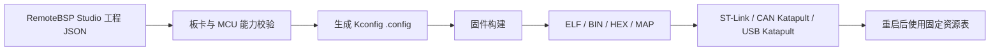

# 固件配置与 RemoteBSP Studio

## 最终配置模型

RemoteBSP 采用“图形化工程配置、生成板卡专用固件、烧录后重启生效”的模式。
系统不支持运行中动态申请 IO，也不再使用 RBSM 或 Flash A/B 资源槽在线改变
GPIO、UART、运动轴、PWM、WS2812 等接线关系。



Studio 工程是配置真相；Kconfig 是生成器和构建系统之间的稳定接口。
`menuconfig` 仍保留给开发、CI、故障排查和没有 GUI 的场合，但普通用户不需要直接
编辑它。

## Kconfig 负责什么

由 Studio 生成的 `.config` 同时表达以下内容：

- MCU、板型、Flash/RAM 型号；
- HSE/LSE、系统主频和时钟策略；
- CAN、CAN-FD 或 USB APP 主链路、速率、固定引脚和设备标识；
- Katapult 与 APP 的 Flash 布局；
- GPIO、UART、运动、TMC2209 单线通信、PWM、定时位流等模块是否链接；
- 最大轴数、队列深度、UART 缓冲和波形通道数等静态预算；
- GPI/GPO、UART、STEP/DIR/EN/DIAG、TMC、PWM、WS2812 的具体映射与安全状态。

未启用模块不得进入最终 ELF，也不得占用静态 RAM、定时器、DMA 或中断资源。
资源映射编译进 APP，启动时建立一次；修改映射必须重新生成、构建、烧录并重启。

## 固定功能引脚与冲突检查

Studio 并不允许任意 IO 承担任意功能。生成器需要同时遵守：

1. MCU 能力：GPIO、AF、UART、定时器通道、ADC、DMA、EXTI 的合法映射；
2. 板级约束：晶振、SWD、CAN、USB、LED、按键、收发器及外围电路的固定占用；
3. 后端能力：已经实现并验证的 UART、PWM、WS2812、运动定时器组合；
4. 全局冲突：重复引脚、定时器通道、DMA、容量、共享 EN 和性能预算；
5. 安全约束：输出初值、有效电平、故障安全电平、输入上下拉与滤波。

GUI 会隐藏固定占用和已选择的引脚，生成器仍会做独立校验，固件启动时保留最后
一道安全检查。错误配置不能部分激活。

当前生成器支持三块正式板卡、最多五轴、共享 EN、DIR 反相、TMC2209 地址 0–3、
静态 GPIO、一个已实现硬件 UART 端点、一个已实现 PWM 端点和一个已实现
WS2812/定时位流端点，并检查单轴及整板步频预算。后续扩展应补全机器可读的 MCU
复用图，而不是在 GUI 和 `main.c` 中分别维护规则。

## 运行时可以做什么

资源拓扑固定不表示资源状态固定。Linux 仍可通过逻辑资源 ID：

- 读写 GPIO；
- 收发 UART；
- 启停 PWM、修改实时占空比；
- 发送 WS2812 像素数据；
- 提交运动段、停止、复位和读取运动状态；
- 查询健康、遥测、资源合同和故障信息。

远程命令不携带物理引脚号，不能把正在运行的引脚改作另一类外设。

## 独立设备参数区

资源拓扑之外仍需要少量可维护的持久参数。当前使用 MCU 内部 Flash 模拟 EEPROM，
后续可通过同一存储接口切换为外部 EEPROM，而无需修改远程协议。

当前参数包括：

- SN 和持久 UUID；
- 硬件版本、制造批次和制造日期；
- 设备名称；
- ADC 校准数据。

参数存储采用两个擦除页、CRC、代数和提交标记，以完整快照方式切换，避免掉电留下
半份有效数据。F103 保留末尾 2 KiB，F072 和 G431 各保留末尾 4 KiB。Katapult 的
应用写入上限分别设置为 F103 `0x0801f800`、F072/G431 `0x0801f000`，正常 APP
升级不会擦除这些参数。

设备参数区不保存 IO 映射、运动轴接线或资源拓扑，也不承担固件 A/B 分区。

参数可通过 `libremotebsp` 或 CLI 维护：

```sh
./build-wsl/remote-cli --node 1 param-status
./build-wsl/remote-cli --node 1 param-list
./build-wsl/remote-cli --node 1 param-get serial-number
./build-wsl/remote-cli --node 1 param-set serial-number RBSP-000001
# 12字节：gain_q16_16=1.0、offset_uv=0、reference_uv=3300000，小端编码。
./build-wsl/remote-cli --node 1 param-set adc0 hex:0000010000000000a05a3200
```

写入流程在客户端内部完成临时解锁、代数检查、写入和重新锁定。后续生产工具还需
增加权限分级、批量烧号、审计日志、schema 迁移及实板掉电测试。

## Studio 当前完成度

已完成：

- 版本化 JSON 工程草案；
- 板卡目录、分组引脚选择、固定占用和重复选择过滤；
- GPIO、UART、运动轴、共享 EN、DIR 反相、TMC2209、PWM、WS2812 编辑；
- 后端 `/api/project/generate`，生成完整 Kconfig `.config`；
- 后端 `/api/project/build`，固定命令与目录、32线程构建、产物归档和白名单下载；
- 归档Studio工程、`.config`、ELF/BIN/HEX/MAP、日志、工具链/Git信息和SHA-256，
  并从链接器输出提取结构化Flash/RAM占用；
- 生成可下载的中文接线表、JSON资源占用摘要、稳定排序资源清单及`SHA256SUMS`，
  接线资料和固件配置复用同一套后端静态校验；
- 提供两份版本化工程的只读比较接口与图形入口，区分 schema、板卡、资源增删、
  引脚/父子关系、合同和普通设置变化，并给出面向非技术用户的中文摘要；
- 从同一份比较结果确定性导出版本化 JSON、中文 Markdown 差异报告和
  `SHA256SUMS`；稳定哈希、输入迁移和截断数量均可复核，且不写服务器文件；
- 生成确定、版本化的纯软件生产记录，关联工程/资源/资料包哈希及已有构建记录中
  的 Git、工具链、内存和产物证据；缺失、不匹配、未烧录和未实测均显式标记；
- 三块正式板卡通过上述Studio后端完成真实交叉编译；
- Mock GPIO、步进位置、PWM、WS2812 和故障状态可视化。

尚未完成：

- ST-Link、CAN Katapult、USB Katapult 烧录和回读核对；
- 完整 MCU 引脚复用、定时器和 DMA 数据库；
- 将烧录回读结果、节点 UUID 和实体电气验收证据追加到生产记录；
- 设备参数的 GUI 维护页。

## 推荐生成物

当前一次构建保存：

- Studio 工程 JSON 与最终 `.config`；
- `.elf`、`.bin`、`.hex`、`.map`；
- MCU、板卡、Git 提交、配置哈希和工具链版本；
- Flash/RAM 占用与构建日志；
- 烧录方式以及烧录后读取到的固件版本、UUID 和配置哈希。

构建、烧录后端必须与网页界面解耦，命令行、CI 和批量生产工具调用同一套接口。
