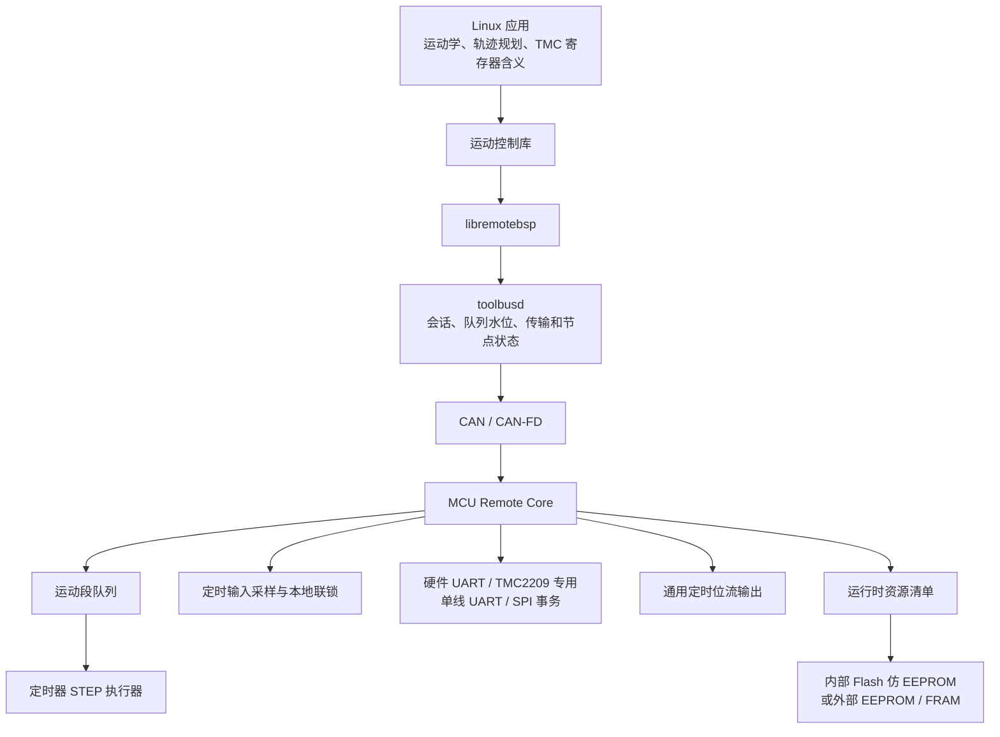

# 智能实时资源与多轴运动控制设计

> 状态：Mock 第一阶段已实现；实体 STM32 执行器和跨板同步待实现。

## 当前实现快照

已经完成：

- 新增 `STEPGEN_AXIS` 资源类型和 Motion 能力位。
- 默认 Mock 描述只是3轴示例；执行器不依赖固定轴数。v1线格式允许单节点最多
  64轴，实际轴数和队列深度由板卡描述、固件裁剪和性能标定共同限制。
- 运动段使用显式小端线格式，包含连续序号、绝对/自动开始时间、持续时间、
  最终段标志和每轴有符号步数。
- Linux C++ API 和 `remote-cli` 支持入队、状态、主动停止和故障清除。
- Mock 执行器按共同纳秒时间基准生成多轴 STEP/DIR/EN 边沿，拒绝晚到、乱序、
  重复轴、未知轴、超步频、时序冲突和队列溢出。
- 非最终段执行完但没有下一段时锁存 `QUEUE_UNDERRUN`；限位和主动停止立即清空
  队列、结束 STEP 高电平并关闭 EN。
- 运动状态提供队列深度、段序号、轴位置、边沿/步数、拒绝、欠载、限位和安全
  停机计数；`toolbusd` 把入队/状态归为运动业务，把主动停止归为保证发送的安全
  业务；清除故障仍是普通交互业务。
- Classical CAN 和 CAN-FD 都已完成默认3轴远程端到端测试，并用12轴执行器和
  64轴编解码边界测试证明不存在三轴语义限制。请求重试由现有去重缓存保证不会
  重复入队。

当前 Mock 使用“段内均匀分布步数”的确定性模型，目的是先冻结队列、安全和
传输语义。它还不是完整速度曲线或 DDA 轨迹格式；Linux 轨迹规划器、跨板
`PREPARE/READY/COMMIT`、时钟偏移/漂移估计、TMC 和 STM32 定时器后端仍在后续。

### 轴数不是系统级常量

每块板只承诺自己能够稳定执行的轴数、持续步频、同时边沿数和队列深度。F103
可以选择较少轴和较浅队列，G431或后续更高性能节点可以选择更多；不能为了统一
接口而让低性能板虚报能力。一个逻辑`MOTION_GROUP`可以组合多个节点的轴，Linux
按节点拆分同一全局轨迹，并通过跨板准备/提交协议统一开始。当前64轴仅是单节点
v1状态报文的有界编解码预算，不是整机总轴数限制。

本文定义 Remote BSP 后续的多轴步进电机、定时输入、TMC 驱动访问、WS2812
等定时位流输出和运行时板级配置方案。目标是获得接近 Klipper 的主机规划、
MCU 确定性执行效果，同时保持 Remote BSP 的传输无关、通用资源和故障隔离
原则。

## 设计目标

- 使用定时器驱动 `STEP`，配合 `DIR`、`EN` 控制多个步进轴。
- 同一运动组内的多个轴共享时间基准，能够同步启动、变速和停止。
- 限位开关必须能在 MCU 本地停止相关运动，不依赖 CAN 往返。
- 按钮、限位和驱动器 `DIAG` 输入支持定时采样、消抖和带时间戳事件。
- Linux 通过 TMC2209 专用单线 UART 或 SPI 事务访问 TMC 系列驱动器。
- Linux 通过通用定时位流资源驱动 WS2812 等单线脉宽编码设备。
- 固件可按功能裁剪；未选择的功能不编译、不链接，也不占用 RAM 和中断。
- 步进引脚、输入引脚、总线选择和 TMC 接线可以由主机修改并持久保存。
- 配置损坏、升级断电或写入中断时，节点仍能回退到最后一个有效配置。
- 一个运动组、一个串口或一块节点异常，不能阻塞无关节点和资源。

首版不承诺通用 CNC 插补器、G-code 解释器或完整 3D 打印控制栈。这些属于
Linux 应用层；MCU 只执行已经排好时间的原子动作。

## 分层边界



Linux 负责：

- 运动学、加减速、速度曲线和各轴步数计算。
- 把连续轨迹转换为可压缩、带执行时间的运动段。
- TMC 型号、寄存器语义、CRC、初始化序列和诊断解释。
- WS2812 颜色顺序、像素布局、亮度、动画和位流生成。
- 资源清单的编辑、静态检查和部署。

MCU 负责：

- 按共同单调时钟执行已排程的 STEP 边沿。
- 保证方向建立时间、STEP 高低电平宽度和使能时序。
- 限位、急停和队列欠载时进入预定义安全状态。
- 执行原始 UART/SPI 事务，不理解 TMC 寄存器的业务含义。
- 按主机给出的高低脉宽参数执行打包位流，不理解 LED 或像素语义。
- 校验、持久化并应用资源清单。

### 当前实体固件执行器基础

`firmware/src/motion.c`已经提供不依赖具体STM32系列的可选定时执行器：

- TIM2 以 1 MHz 自由运行并扩展为64位单调时钟，CH1 compare只在下一条STEP
  上升沿、下降沿或运动段边界到期时触发，不再使用固定频率轮询中断。
- 每段启动时将边沿间隔拆成整数商和余数；compare ISR只执行加法、比较和GPIO
  操作，通过Bresenham/DDA均匀分配不能整除的纳秒余数。
- 入队同时检查单轴最大步频、整板总STEP频率、STEP高/低电平和DIR建立时间；
  超出编译期安全预算的运动段直接拒绝，不允许静默降速。
- 多轴同一时刻到期的边沿在一次ISR中处理。compare迟到超过预算时禁止突发补步，
  立即锁存`TIMING`故障、清空队列并关闭运动输出。
- 主循环追加运动段时使用短临界区保护，正在运行的段不会因为新段入队而重新进入
  `ARMED`状态。
- 连续段队列、最终段自动关闭使能、队列欠载、主动中止、故障清除和水位/
  停机指标已有主机单元测试。

F072、F103、G431共用上述运动核心和1 MHz时间单位，各自只实现TIM2 compare与
GPIO薄适配层。F072/F103原先占用的TIM3、G431原先占用的TIM4已经释放，可供PWM、
定时位流等模块使用。三种五轴固件均已交叉编译，Mock/主机测试覆盖精确边沿、
不可整除DDA、脉宽、总步频拒绝、迟到停机和运行中追加队列。FLY-D5此前固定tick
版本已完成五轴实板运动验证；compare版本仍需重新做示波器和持续负载验收，不能
直接把编译期预算当作实板性能保证。

F072/F103/G431 现均有各自的 GPIO 与定时器后端：引脚在启用后从通用 GPIO 中保留，
但限位输入、运行时 NVM 映射以及 F103/G431 的实体板验收尚未完成。当前
软 UART 后端会短时关中断，运动期间主动拒绝 UART 写事务，待替换为非阻塞状态机
后才可宣称 TMC 查询与 STEP 真正并发。

`toolbusd` 不做运动学计算。它负责可靠传送、节点时钟同步、队列水位和错误事件，
避免设备协议逐渐混入守护进程。

## 智能资源模型

在 GPIO、UART 等普通资源之外，增加以下复合资源：

| 资源 | 职责 |
|---|---|
| `STEPGEN_AXIS` | 一个轴的 STEP/DIR/EN 引脚、极性、时序限制和运行状态 |
| `MOTION_GROUP` | 共享时间基准和队列的一组轴，保证同步执行 |
| `DIGITAL_INPUT` | 限位、按钮、急停或驱动器 DIAG 输入 |
| `INPUT_SAMPLER` | 定时采样、消抖、边沿检测、时间戳和本地联锁 |
| `UART_BUS` | 全双工或半双工原始事务 |
| `TMC2209_UART` | 已选择 TMC2209 步进槽上的固定 40000 bit/s 单线事务 |
| `SPI_BUS` | 模式、频率、位宽和片选受控的原始事务 |
| `TIMED_BITSTREAM` | 按可校验的 0/1 高低脉宽输出打包位流 |
| `PERSISTENT_CONFIG` | 运行时资源清单的读取、校验、提交和回滚 |

复合资源拥有其底层资源。被 `STEPGEN_AXIS` 占用的定时器通道和 GPIO 不再作为
普通 GPIO/Timer 对外分配；被板级扩展串口占用的 SPI 也不能再次作为通用 SPI
使用。资源枚举必须报告依赖和占用关系。

## 多轴 STEP 执行

### 不逐脉冲传输

主机不能经 CAN 为每个 STEP 发送一条命令。这样既浪费带宽，也会把总线抖动
直接变成电机抖动。Linux 应提前生成运动段，MCU 将运动段放入有界队列，并由
硬件定时器独立执行。

首版运动段采用定点整数表示，不在 MCU 中使用浮点轨迹规划。逻辑字段包括：

- 运动组 ID 和严格递增的段序号。
- MCU 单调时钟下的绝对开始时间。
- 段持续时间。
- 每轴方向、步数和初始步进间隔。
- 每步间隔增量，或等价的定点 DDA/Bresenham 参数。
- 段末策略和可选联锁掩码。

第一版线格式已在 `protocol/motion.*` 中显式编解码，不直接发送 C 结构体内存。
后续增加 DDA/加速度字段时必须以新版本演进，不能改变既有字段含义。

### 同步方法

一个 `MOTION_GROUP` 使用一个高分辨率主定时器和同一个当前段。每个轴保存下一
事件时间，比较中断只处理已经到期的 STEP 边沿，再安排最早的下一个事件。这样
多个轴的相对时间来自同一计数器，不依赖多个独立线程或 CAN 包到达先后。

时间基准使用回绕安全的整数比较。同一 MCU 内的同步只受一个硬件时钟和中断
延迟影响；不同 MCU 的晶振必然存在初始偏差、温漂和长期漂移，因此跨节点同步
使用下一节的独立机制和误差等级。

## 跨板卡同步

### 全局运动时间

`toolbusd` 维护单调递增的 64 位全局运动时间。每个 MCU 继续使用高效的本地
定时器计数器，并维护下面的映射，而不是反复校准或修改硬件时钟：

```text
本地定时器 tick = 比例 × 全局运动时间 + 偏移
```

比例表示本地晶振的实际频率和漂移，偏移表示两个时间域的起点差。换算只在运动
段入队或段边界进行，STEP 中断不做除法或复杂拟合。实现时使用定点数和回绕安全
扩展，将 MCU 的较短计数器扩展为逻辑 64 位时间。

主机周期执行四时间戳同步：

1. 主机记录同步请求发送时间。
2. MCU 在 CAN 接收路径尽早锁存本地接收 tick。
3. MCU 在响应发送前锁存本地发送 tick。
4. 主机读取 SocketCAN 接收时间戳。

`toolbusd` 从连续样本中优先选择往返时延较小的样本，并通过滑动拟合估计频率
和偏移；拥塞、仲裁等待和调度暂停造成的离群样本不立即改变时间模型。具备 CAN
硬件时间戳的目标可以提高精度，但首版不能依赖所有适配器都支持硬件时间戳。

每个节点公开：

- 时钟模型代数、估计频率和最近同步时间。
- 当前偏移误差上界、漂移上界和样本往返时延。
- `SYNCED`、`DEGRADED`、`UNSYNCED` 状态。
- 可承诺的最小排程提前量和定时器分辨率。

运动组的允许同步误差由主机策略配置。任一成员误差上界超过要求时，跨板运动
不能进入就绪状态。不得为了“看起来同步”而在运动中突跳本地时间；频率修正应
平滑应用到尚未执行的段，已入队段只能在安全边界重新换算。

### 预装、就绪和统一提交

不同板卡不能依次收到“立即启动”命令。跨板运动采用带全局事务 ID 和未来绝对
开始时间的分阶段流程：

1. `MOTION_PREPARE`：主机向所有成员下发同一代运动计划和各自的运动段。
2. `MOTION_READY`：节点完成格式、资源、队列、时钟和安全检查后报告就绪。
3. `MOTION_COMMIT`：所有成员就绪后，主机提交一个足够远的全局开始时间。
4. 节点确认已武装；主机在保护截止时间前确认所有成员状态。
5. 到达绝对开始时间后，各节点按自己的时钟映射同时执行。

CAN 上可以广播提交消息并重复发送；其他传输也可以分别发送同一个绝对开始
时间。同步来自绝对时间而不是消息同时到达，因此协议不依赖 CAN 的广播特性。
提交、取消和重发都携带事务 ID、计划代数和内容摘要，必须幂等。

任一成员在提交前未就绪，主机向已准备节点发送 `MOTION_ABORT`，整组不启动。
进入已提交状态后，节点不能静默替换计划。为了避免提交响应丢失产生歧义，开始
时间必须晚于提交确认保护窗；保护窗结束仍无法确认全部节点时执行组策略：
默认取消并令所有可达节点进入安全状态。

网络中无法在节点任意失电的情况下获得数学意义上绝对无条件的“同时提交”。
本设计保证所有健康、已同步且在截止时间内完成确认的节点按同一时间执行；
节点在最终提交后突然失电属于运行期组故障，必须由安全域策略处理，而不是对
应用隐瞒。

### 持续运行与同步失效

长时间轨迹仍按全局时间轴连续排程，并持续更新尚未执行段的时钟换算。每块节点
独立报告前瞻时间，主机以组内最小值作为整个运动组的真实余量。

- 不允许某块板耗尽队列后其他板无限继续。
- 任一关键成员低于队列低水位时，主机优先补充该成员，并限制继续接受新轨迹。
- 时钟误差、队列余量或通信质量越过停止阈值时，在共同段边界受控停止。
- 已无法保证共同段边界时，按安全策略立即停止并锁存不同步故障。
- 节点重新上线后不能自动接续旧事务，必须重新归零或由应用显式恢复位置。

### 跨板限位的边界

本地输入停止本地 STEP 是确定性的快速路径。若限位接在节点 A，而必须停止的
电机位于节点 B，则停止命令需要经过 CAN，延迟包括输入消抖、事件发送、总线
仲裁、接收和 B 节点定时器响应，不能宣称与本地联锁具有相同实时性。

安全关键场景优先采用以下顺序：

1. 限位与受控 STEP 轴放在同一节点。
2. 将同一个限位硬件并联或隔离后接入所有相关节点。
3. 增加独立硬件急停/同步线，直接关断驱动使能。
4. 最后才使用高优先级 CAN 组停止，并把实测最坏停止延迟计入机械余量。

跨板回零和探测必须有独立能力标志及误差说明。其停止位置不能直接沿用本地限位
精度假设。

### 实时执行约束

- 中断只更新 GPIO/比较寄存器和少量定点状态，不解包协议、不访问 Flash。
- STEP 高电平结束事件优先于低优先级输入和通信任务。
- 每个段必须在开始时间之前进入队列；建议正常保有至少 `100 ms` 前瞻。
- MCU 报告队列深度、剩余执行时间、最晚到达裕量和欠载计数。
- 队列满时拒绝整段，不允许只接收一半造成轨迹不一致。
- 段序号和请求去重共同防止重试导致同一轨迹执行两次。
- 超过硬件能力的步频、同时边沿数或中断占用率必须在入队时拒绝。

F103 和 G431 的最大轴数、最高持续步频及最坏中断延迟不能写死为宣传值，必须
通过后续基准测试确定并作为能力字段上报。G431 是多轴高性能场景的优先目标；
F103 保留一个经过约束的小规模配置。

## 定时输入、限位和按钮

`INPUT_SAMPLER` 按配置周期采样一组数字输入，提供：

- 输入极性、内部上拉/下拉和安全默认值。
- 连续样本计数或时间窗消抖。
- 上升沿、下降沿和电平事件。
- MCU 时间戳、丢失事件计数和最近稳定状态。
- 限位到运动组/轴/方向的本地联锁映射。

限位和急停分为快速安全路径与普通事件路径。快速路径直接禁止新的 STEP 边沿，
按策略拉到安全的 `EN` 电平并锁存原因；随后再向 Linux 上报事件。按钮可以使用
更低采样频率和普通事件优先级。

对 TMC 无传感器回零而言，`DIAG` 在 MCU 看来仍是一个数字联锁输入。TMC 阈值
和寄存器配置由 Linux 完成。

## TMC UART/SPI 访问

Remote BSP 不在 MCU Remote Core 中加入 `TMC2209`、`TMC5160` 等型号驱动。
MCU 只提供可选的通用事务执行器：

- UART：波特率、半双工方向切换、超时、发送和定长/空闲接收。
- SPI：模式 0～3、频率、位宽、片选、发送、接收和全双工交换。
- 可选的事务序列：在一个不可被其他客户端插入的短临界区内完成多次原子交换。

Linux TMC 库负责数据报 CRC、寄存器地址、读写位、初始化、故障解释和型号差异。
这样增加新 TMC 型号通常不需要升级 MCU 固件。

若实际工具板使用 SPI 转 UART 芯片，该 SPI 属于板级资源适配器的内部依赖；
上位机仍只看到若干逻辑 UART。用于直接控制 TMC 的 SPI/UART 则按运行时资源
清单创建，应用通过稳定逻辑 ID 使用。

TMC2209 专用单线 UART 不是 FLY-D5 专用功能。后端由 F072、F103、G431 共同复用，
各 MCU 只提供定时器、GPIO 输入输出切换和精确采样实现。FLY-D5 的 PC13、PC3、
PA3、PA7、PB1 只是五个板级实例。`CONFIG_REMOTEBSP_TMC2209_UART` 独立决定是否
链接内部后端，静态槽选择 TMC2209 时会自动带入该模块；波特率固定为 TMC2209
所需的 40000 bit/s。F072/F103 的硬件 USART 与该后端分别计数，可以同时编译，
不会再因为启用 TMC 而隐藏或关闭普通 USART1。

该接口不是标准两线 RS-485 Modbus 后端，也不向应用公开为通用串口。普通 Modbus
RTU 的 RX/TX/DE 引脚、485 方向控制、帧间隔和持续流式接收将由独立的硬件 UART
适配器实现，不能复用 TMC2209 单线接口。

## WS2812 与通用定时位流

第一阶段已经落地：协议、Linux API/CLI、Mock/数字孪生与F072/F103/G431的
TIM1_CH1+DMA后端完成，三块命名板卡均能交叉编译。以下仍是实体时序验收和
运行时资源清单的目标边界。

MCU 不保存 WS2812 颜色、动画或灯带模型。Linux 把像素数据转换为打包位流，
并为一个 `TIMED_BITSTREAM` 资源提供以下原子事务参数：

- 0 位和 1 位各自的高、低电平持续时间。
- 位流初始/结束电平和复位保持时间。
- 打包位顺序、位数、开始时间和完成事件要求。

STM32 优先使用定时器 PWM + DMA 生成波形。只有最坏时延经过实体测试的定时器
中断后端才能作为降级方案；禁止用长时间忙等待和全局关中断实现，因为这会破坏
STEP、CAN 和安全输入的实时性。

该能力由 `CONFIG_REMOTEBSP_TIMED_BITSTREAM` 独立裁剪。关闭时源文件、DMA
描述、静态位流缓冲和资源状态都不进入最终固件。运行时清单决定通道、GPIO、
定时器、DMA、最大位流长度和缓冲策略，并与 STEPGEN、PWM、UART 等资源统一
检查冲突。WS2812 数据属于低优先级业务，不能挤占运动、安全和心跳预算。

## menuconfig 与运行时配置的边界

`menuconfig` 只保存无法在运行时安全改变、或会决定是否链接代码的项目：

- MCU 型号、板型、晶振和系统时钟。
- CAN/CAN-FD 控制器、固定引脚组、速率上限和收发器控制。
- Katapult USB 恢复口占用、Bootloader 和 APP Flash 布局。
- 是否编译 `STEPGEN`、`INPUT_SAMPLER`、`UART`、`SPI`、`PWM`、`TIMED_BITSTREAM`、
  `NVM_CONFIG` 等模块。
- 各模块的编译期硬上限，例如最大轴数和静态队列内存预算。

当前已经落地的运动选项为：

- `CONFIG_REMOTEBSP_MOTION`：是否编译运动模块，默认关闭。
- `CONFIG_MOTION_MAX_AXES`：本板编译期最大轴数。
- `CONFIG_MOTION_QUEUE_DEPTH`：本板固定分配的运动段槽数量。
- `CONFIG_MOTION_MIN_LEAD_TIME_US`：本板接受排程的最小提前量。
- `CONFIG_MOTION_MAX_STEP_RATE_HZ`：单轴入队步频预算。
- `CONFIG_MOTION_MAX_TOTAL_STEP_RATE_HZ`：整板所有轴的总STEP频率预算。
- `CONFIG_MOTION_STEP_PULSE_WIDTH_US`、`CONFIG_MOTION_MIN_STEP_LOW_US`：驱动器
  脉冲时序约束。
- `CONFIG_MOTION_DIRECTION_SETUP_US`：DIR变化到首个STEP的建立时间。
- `CONFIG_MOTION_COMPARE_MIN_LEAD_US`、`CONFIG_MOTION_MAX_COMPARE_LATENESS_US`：
  compare写入安全余量和迟到停机阈值。

计划增加的跨 MCU 选项为：

- `CONFIG_REMOTEBSP_TIMED_BITSTREAM`：WS2812 等设备使用的通用定时位流。

定时位流默认关闭，并采用与运动模块相同的条件源文件和条件状态存储机制。TMC2209
单线后端有独立的功能裁剪开关和端口容量，但不暴露成通用软串口或 Modbus 后端；
兼容期静态槽选择 TMC2209 时会自动启用该模块。

未启用模块使用 Kconfig 依赖和 CMake 条件源列表从最终 ELF 中移除，而不是只在
运行时隐藏。

当前 STM32 代码已加入按 `CONFIG_REMOTEBSP_MOTION` 编译的固定容量 C 运动队列
核心；关闭时源文件和 `rbsp_core_t` 中的队列存储都不存在。该核心已经验证连续
序号、自动接续、容量、欠载、停止和清故障；F072/F103/G431 的首版 STEP 定时器
后端与远程运动命令已接入。当前 `MOTION_SLOT0...` Kconfig 映射只是实体板验证
使用的临时出厂默认布局。选择项已经改为按 GPIO 端口标注的 Kconfig `choice`，
固定外设以及前面字段选过的引脚会被隐藏；它仍必须迁移为下述运行时资源清单，
不能作为最终接线真相。

运行时资源清单保存：

- 轴使用的 STEP/DIR/EN 引脚及极性；DIR 反相属于运行时机械方向定义，不需要
  改线或重新编译固件。
- EN 可以是独占输出，也可以引用一个共享使能组；STEP、DIR、限位和 TMC 通讯
  引脚仍必须独占。共享组内至少一个轴请求使能时保持物理 EN 有效，最后一个轴
  释放时才关闭，并且组内所有轴必须使用相同有效极性。
- 轴与定时器/运动组的映射和最小时序。
- 限位、按钮、急停、DIAG 引脚及消抖和联锁关系。
- TMC 使用 UART 还是 SPI，对应总线、片选/地址和 GPIO。
- 逻辑资源名称、稳定 ID、依赖关系和安全初始状态。

因此更改接线通常只需主机部署新配置，不需要重新编译；更换 MCU、晶振、CAN 或
启用原先未链接的功能才需要重编固件。当前持久化加载器尚未实现，因此上述能力
是下一阶段最高优先级，现有 Kconfig 槽位只用于生成首次启动的出厂默认清单。

共享 EN 的物理含义是：组内任意轴运行时，所有共线驱动器都会处于电气使能状态，
即使其中某个逻辑轴此刻不发 STEP，也不能单独释放该电机保持电流。因此它适合
板卡原理图本来就共用 EN，或明确接受整组上下电的设计，不能当作节省 GPIO 的
无代价优化。

## 类设备树资源清单

MCU 不解析 DTS、JSON 或 YAML。主机工具可以使用可读的 YAML/JSON 作为编辑
格式，但下发前必须编译为版本化二进制 TLV/资源图。每个节点至少含：

- `schema_version`、板型、硬件 ID 约束和配置代数。
- 资源稳定 ID、资源类型和属性。
- 对其他资源的引用。
- 长度和 CRC-32。

节点接收后必须检查：

- 引脚和复用功能在当前芯片上存在。
- SWD、CAN、Katapult USB 恢复口、晶振和 Bootloader 保留资源没有被占用。
- GPIO、定时器通道、DMA、UART、SPI 和片选不存在冲突。
- 引用存在且资源依赖无环。
- 所有输出都有明确安全电平。
- 数量、队列和速率不超过编译期能力。
- 清单板型/硬件 ID 与当前硬件匹配。

当前已提供第一版类似 STM32CubeMX 的本地配置与数字孪生 GUI，能够显示已知板卡
固定占用、过滤重复引脚、编辑运动轴草案并导出 JSON。下一步是补齐芯片复用、
定时器和 DMA 约束，把草案编译成正式二进制资源图并通过 toolbusd 部署到节点。
GUI 只调用公共 schema、校验器和配置编译器；同一套底层能力也必须可由命令行、
测试和生产工具使用。
详细功能和验收条件记录在[项目待办](../TODO.md)。

## 非易失存储与原子更新

持久化后端使用统一接口。F103/G431 首版可用内部 Flash 仿 EEPROM，后续可以
增加外部 EEPROM 或 FRAM，而不改变配置协议。

内部 Flash 至少保留 A/B 两个槽，每槽具有头、内容和提交标记：

1. 主机分块写入非活动槽。
2. 节点检查长度、CRC、版本、资源冲突和安全约束。
3. 主机显式提交，节点最后写入提交标记。
4. 重启时选择代数最新且完整有效的槽。
5. 写入断电或新槽无效时继续使用旧槽。

建议的管理命令为：

```text
CONFIG_READ
CONFIG_STAGE_BEGIN
CONFIG_STAGE_WRITE
CONFIG_VALIDATE
CONFIG_COMMIT
CONFIG_ROLLBACK
```

写配置、提交和回滚都是带副作用操作，必须进入现有请求去重缓存。运动运行时
禁止擦写内部 Flash；配置提交要求所有相关运动组停止并处于安全状态。

固件链接脚本必须从 APP 可用区末端显式扣除配置区，Katapult 在线升级也必须
保留该区域。当前链接脚本仍允许 APP 使用 Bootloader 之后的全部 Flash，因此
实现 NVM 前要先完成 Flash 分区，不能直接在末尾“找两个空页”。

## 故障模型与安全状态

每个运动组至少报告：

- 正常、待启动、运行、停止中、已锁存故障。
- 队列过满、队列欠载、运动段迟到或序号错误。
- 超出步频能力、定时器过载或方向建立时间不足。
- 限位、急停、DIAG 和驱动通信错误。
- 配置无效、时钟未同步和节点通信丢失。

安全策略必须是运行时配置的一部分，但只允许从固件支持的有限策略中选择：

- 立即停止 STEP，并立即或延时关闭 EN。
- 完成当前脉冲后停止，禁止产生窄脉冲。
- 锁存故障，要求显式清除，禁止自动恢复运动。
- CAN 心跳丢失时继续耗尽已批准队列，或立即安全停机。

默认采用保守策略：配置无效、队列欠载、急停或本地联锁触发时停止脉冲、关闭
相关使能并锁存原因。一个组的故障不得清空其他组或其他节点的队列，除非它们
显式属于同一个安全域。

## 性能遥测与 CPU 占用

节点必须提供低开销的性能遥测。平均 CPU 占用率只能用于观察趋势，实时运动
是否可靠还要结合最坏中断执行时间和定时事件迟到量判断。

MCU 节点级指标至少包括：

- 最近统计窗口的 CPU 占用率，以及启动后的最大窗口占用率。
- 空闲 tick、总运行 tick、统计窗口长度和指标有效标志。
- STEP 定时中断的调用次数、平均/最大执行 tick。
- 定时事件最大迟到 tick、超过实时预算的次数。
- 关中断最长时间和通信主循环最大调度间隔。
- 当前栈余量/历史最低栈余量，以及静态缓冲高水位。
- 复位原因、看门狗次数、主循环过载次数和错误锁存。

运动组和资源级指标至少包括：

- 运动段队列深度、剩余执行时间、低水位和欠载/过载次数。
- 每轴实际 STEP 数、拒绝段数、限位和安全停止次数。
- UART/SPI 事务数量、超时、校验/硬件错误和缓冲高水位。
- 输入采样次数、抖动过滤次数、事件丢失和最大上报延迟。

MCU 可以使用 DWT cycle counter 或通用自由运行定时器累计忙碌和中断周期；
不具备对应硬件时退化为空闲循环计数。线上格式使用整数 tick、千分比或万分比，
不在实时路径使用浮点。统计窗口切换采用常数时间快照，不在 STEP 中断里格式化
协议或遍历资源。

Linux 侧同时统计：

- `toolbusd` 进程及关键线程 CPU 占用。
- 接收线程、请求管理器和 IPC 事件循环的最大调度延迟。
- 请求往返时间、超时、重试、重复响应和事件队列水位。
- 各节点收发帧率、有效载荷率和估算 CAN/CAN-FD 总线占用率。
- SocketCAN 提供的 RX/TX 错误、丢包、error-passive 和 bus-off 状态。

由于 Classical CAN 位填充和仲裁会改变真实线占用，纯软件计算值必须标记为
“估算”；适配器或控制器能够提供硬件计数器时再同时报告实测值。

建议增加版本化的 `NODE_METRICS`、`RESOURCE_METRICS` 和
`METRICS_RESET` 命令。常规指标由主机低频拉取，只有越过阈值或发生故障时才
发送事件；遥测使用最低业务优先级，拥塞时宁可丢弃遥测，也不能挤占 STEP 段、
限位和心跳。基础统计可默认启用，细粒度函数跟踪通过 `CONFIG_PERF_TRACE`
选择，未启用时不链接详细插桩代码。

## 实现顺序

1. 冻结资源图、时间模型、运动段和配置协议，先在 Mock MCU 中验证。
2. 实现 A/B 持久化、Flash 分区、资源冲突检查和主机配置编译器。
3. 实现单轴定时 STEP、方向/使能时序和输入采样。
4. 实现同 MCU 多轴同步、前瞻队列、限位联锁和故障事件。
5. 完善 F072/F103/G431 共用的 TMC2209 单线 UART、通用 SPI 事务及 Linux TMC 库。
6. 完成通用PWM/定时位流第一阶段：协议、Mock数字孪生和STM32定时器+DMA后端。
7. 使用示波器和WS2812实体灯带验证定时位流，并进行F103极限测试，确定可承诺的小规模能力。
8. 在 G431 实板验证 CAN-FD 下的高轴数、持续步频、位流并发和故障恢复。
9. 最后再评估跨节点同步和更高级插补。

每一步都必须先有 Mock/单元测试，再上实体板。至少覆盖段去重、乱序/迟到拒绝、
队列欠载、限位触发、Flash 写入中断、配置回滚、引脚冲突、单资源故障隔离和
CAN 暂时中断后的安全行为。跨板测试还必须覆盖：

- F103/F103、G431/G431 和 F103/G431 混合时钟。
- 空闲、持续高负载和总线仲裁拥塞下的启动偏差。
- 运行数分钟后的累计相位误差和温漂。
- 某节点未就绪、提交丢失、重启或执行中掉线。
- 队列低水位、同步降级和组内统一停止。
- 本地限位与跨板 CAN 限位的最坏停止距离。

测试板在公共运动开始点同时翻转诊断 GPIO，用逻辑分析仪测量板间偏差。首次
实现不预先承诺具体微秒指标；F103 Classical CAN 与 G431 CAN-FD 分别实测后，
把可保证的最大启动偏差、长期漂移和停止延迟写入能力描述。

## 与 Klipper 的关系

本设计参考 Klipper 的主机/MCU 分工、提前排程和短定时中断思想，但使用
Remote BSP 自己的资源模型、会话、CAN 分片、请求去重和故障隔离机制。不会
直接复制 Klipper 的协议或源代码；如将来确实复用 GPLv3 代码，必须单独评估
许可证边界并保留相应授权信息。Klipper 对多 MCU 也分别追踪各 MCU 时钟，并
持续修正从统一运动时间到本地 MCU tick 的换算；Remote BSP 采用相同问题分解，
但会增加显式的组准备、提交、同步误差上报和故障域。
