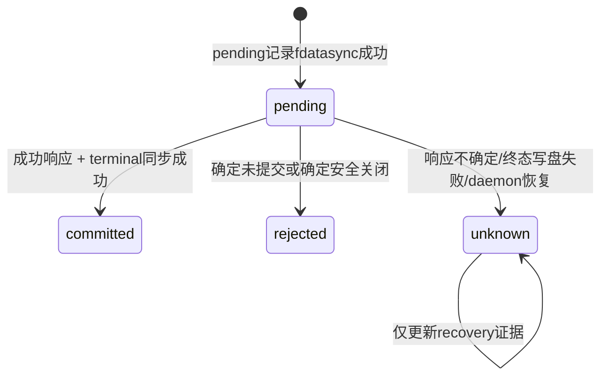

# Runtime 不确定提交恢复与操作结果账本

> 状态：**软件实现已接入并通过单元、Mock 与本地进程测试**。
>
> 本文同时记录当前实现合同与仍需实体环境验证的边界。现有证据不构成真实 CAN、USB、
> GPIO 电平、生产文件系统掉电或实体板卡安全时延证据。

## 1. 目标与边界

当前 GPIO 控制链已经具备短租约、节点 UUID/代次核对、首次低电平创建、安全写低和
`GPIO_CLOSE`。`toolbusd` 操作账本现把 GPIO 写入和释放的 pending/终态持久化；当远端
命令可能已经执行但响应未到达时，系统会返回可查询的 operation 状态，或保守恢复为
`unknown`/`expired_unknown`，不会把未知结果伪装成未执行。

v1 账本的软件实现覆盖以下问题：

- 在任何可能改变 MCU 状态的请求发送前，持久化其操作身份和完整参数摘要；
- 只在成功结果已经持久化后向 Runtime 返回成功；
- daemon 重启后把未完成记录恢复为 `unknown`，禁止把它当作未执行而重发；
- 让 CLI 和 Runtime 查询历史结果，而不要求原租约仍然有效；
- 从历史记录恢复资源作用域阻断，避免新 daemon 接管旧会话遗留对象；
- 对记录数、磁盘大小、保留期和轮转行为给出可自动验证的硬边界。

v1 至少覆盖以下两类操作：

1. `RuntimeGpioWrite`；
2. `RuntimeControlRelease`，包括安全写低和 `GPIO_CLOSE`。

`RuntimeControlAcquire` 只登记 daemon 内存租约，daemon 换代后本来就必须失效，v1
不要求把它作为硬件操作写入结果账本。账本不承诺在 daemon 崩溃后恢复旧租约，也不替代
MCU 本地看门狗、资源租约或实体安全电路。

## 2. 为什么账本必须位于 toolbusd

结果账本的权威实现位于 `toolbusd`，不能位于 Python Runtime：

- 只有 `toolbusd` 知道 mutating Remote Packet 是否进入了发送路径；
- Runtime 观察到的 CLI/IPC 超时既可能发生在发送前，也可能发生在远端已执行之后；
- `RequestManager` 的 `(session_id, request_id)` 只在当前 daemon 会话及短重复窗口内有效；
- Runtime 的 `ControlLeaseManager` 和 `RuntimeControlGate` 内存镜像仍只负责当前进程的
  授权、并发和快速重放；跨进程证据来自 `toolbusd` 的持久账本。

`RequestManager` 仍负责同一次逻辑操作内的传输重试。重试必须保留相同的 session、请求
ID、命令和对象 ID，由 Remote Core 的请求去重阻止重复副作用。账本负责阻止应用重试或
daemon 重启恢复时再次创建一笔新的 mutating 请求。

## 3. 操作身份与参数绑定

### 3.1 operation_id

`operation_id` 是 32 字节 SHA-256 值，由 `toolbusd` 按固定小端、带长度的规范编码计算，
不接受调用方任意指定：

```text
SHA-256(
  "RemoteBSP/runtime-operation/v1\0" ||
  operation_kind:u8 ||
  lease_id:16B ||
  owner_key_id_length:u16 || owner_key_id ||
  idempotency_key_length:u16 || idempotency_key
)
```

`RuntimeGpioWrite` 使用调用方已有的 `idempotency_key`。Release 使用保留键
`release:v1`，因此同一租约的所有释放尝试天然属于同一操作。`operation_id` 以 64 个
小写十六进制字符出现在 JSON 中。

调用方幂等键仍表达业务重试意图；`operation_id` 是 toolbusd 的稳定查询身份。二者不能
互相替代。

### 3.2 request_digest

账本同时保存完整请求的 `request_digest`。其规范编码至少包含：

- 合同版本和操作类型；
- 首次受理该操作的 daemon instance ID；
- lease ID、真实 owner key ID 和权限位；
- 预期节点 UUID、节点 ID、资源 ID；
- Release 使用的服务端单调租约 admission 序号，用于区分同一 lease ID 的不同登记生命周期；
- GPIO 目标值；
- Release 所针对的原租约身份。

同一 `operation_id` 或同一“owner + idempotency”出现不同摘要时必须返回
`IdempotencyConflict`，不得覆盖旧记录或执行硬件 I/O。

### 3.3 有限存储下的“不复用”

系统不宣称用有限磁盘永久保存所有完整参数。“不同参数永久 Conflict”的准确合同是：

- `operation_id` 只由当前活动 lease 和既定幂等身份派生，永远不是创建新操作的入口；
- 完整记录或墓碑仍在时，摘要不符明确返回 Conflict；
- 记录已经超过保留期时，查询返回 `expired_unknown`，绝不返回“未执行”或“可以重发”；
- 完整记录保留期远长于最大 30 秒 lease。记录可删除时，原 lease 必然已经不能授权执行；
- 正常新 lease 使用新的随机 lease ID，因此产生不同 `operation_id`；若同一 lease ID 被异常
  重复登记，Release 的 `operation_id` 仍相同，但服务端单调 `admission_id` 会使
  `request_digest` 不同并触发 `IdempotencyConflict`，旧 Release 终态不能冒充新生命周期。

## 4. 状态机

### 4.1 状态定义

| 状态 | 可证明含义 | 重复提交行为 |
|---|---|---|
| `pending` | 完整 pending 记录已写入并同步到稳定存储；当前 daemon 中唯一执行者可能正在继续 | 等待有界时间或返回 `pending`，不得再次调用 mutating I/O |
| `committed` | 已收到严格匹配的成功响应，且 committed 终态已同步到稳定存储 | 返回相同结果并标记 replay，不访问 MCU |
| `rejected` | 可证明目标效果未提交，或已确定完成安全写低及 Close | 返回相同拒绝和恢复状态，不访问 MCU |
| `unknown` | 请求可能已发送但没有可信结果、终态写盘失败，或重启时恢复到 durable pending | 只允许查询或受控安全协调，禁止重发原目标操作 |
| `expired_unknown` | 查询记录不存在、已过保留期或属于其他 owner；这是查询合成状态，不写入日志 | 返回同形未知结果，不泄漏记录是否存在，也不允许重发旧操作 |

`committed` 只证明历史命令在当时获得成功响应，不证明当前 GPIO 仍处于该值，也不证明
daemon 重启后资源已经可以由新会话接管。

### 4.2 合法转换



`committed`、`rejected` 和历史结果意义上的 `unknown` 都是不可反转终态。安全协调只能
更新 `unknown.recovery`，不能把未知历史伪装成 committed 或 rejected。

### 4.3 recovery 字段

`unknown` 和 `rejected` 必须携带独立恢复状态：

- `not_sent`：确定没有进入 mutating 发送路径；
- `safe_closed`：安全写低和 `GPIO_CLOSE` 均取得确定成功；
- `scope_blocked`：对象或最终电平未知，作用域必须冻结；
- `awaiting_reboot`：等待可验证的 MCU 启动代次变化；
- `node_reboot_confirmed`：稳定 MCU boot generation 已变化，旧对象不可能继续存在。

一旦 mutating 请求进入 `send_packet`，除非收到严格匹配的成功响应，或安全协调确定完成，
否则一律保守归为 `unknown`。普通 C++ 异常文本不能被用来推断“未发送”。发送接口需要
显式返回 `NotSent` 或 `MayHaveBeenSent`。

## 5. RuntimeControlGate 接入点

当前 `ToolbusDaemon` 以 durability 回调把 `OperationLedger` 接入
`RuntimeControlGate::gpio_write()` 和 `release()`：Gate 内存占位负责同作用域串行与异常
回滚，持久索引负责跨进程查询和恢复，两者用途不混淆。

当前执行顺序如下：

1. 在 Gate 锁内验证 daemon、lease、owner、节点、合同和请求摘要；
2. 查询持久索引。terminal 直接返回，`unknown` 直接拒绝执行，Absent 才继续；
3. 在 Gate 锁内完成操作节点、序列化缓冲、GPIO 对象占位和 in-flight 集合的全部分配；
4. 释放 Gate 锁，追加 pending 记录并 `fdatasync`；
5. pending 同步成功后，才允许执行 `create_low()` 和目标 `write_value()`；
6. 严格验证响应的 session、request、command、object 和状态；
7. 先追加 committed/rejected/unknown 终态并同步，再在 Gate 锁内发布结果和唤醒等待者；
8. committed 持久化失败时不得返回成功：RAM 状态改为 unknown，并执行现有安全协调；
9. 所有发送前失败都撤销 RAM 占位；pending 已同步后的失败不得删除操作记录。

`ToolbusDaemon::runtime_gpio_write_operation()` 先按 operation ID 查询持久索引；已有记录
直接返回，Absent 才进入 Gate。Gate 的 pending durability 回调在目标 I/O 前同步记录，
terminal 回调在发布成功前同步终态，以封闭两个并发调用同时执行副作用的竞态。

Release 采用相同的 pending/terminal 边界。Close 不确定时，可以由显式安全协调入口只重试
幂等 Close；该动作不是重发原 GPIO 目标写，并且只能更新 recovery 证据。

## 6. 持久化格式与崩溃恢复

`toolbusd` 启动时必须显式指定账本目录：

```sh
./build-wsl/toolbusd/toolbusd can0 classical /tmp/toolbusd.sock \
  --runtime-operation-ledger-dir /var/lib/remotebsp/operation-ledger
```

目录不存在时以 `0700` 创建；已存在目录必须是当前有效用户拥有、组和其他用户无权限的
真实目录，并以进程锁拒绝两个 daemon 同时使用。正式部署不得使用会随重启清空的目录，
也不得删除记录来绕过 unknown scope 阻断。

### 6.1 文件与记录

v1 使用版本化、追加式分段日志。每条记录包含：

- magic、格式版本、记录类型和精确长度；
- 单调递增的 journal sequence；
- operation ID、request digest、状态和 recovery；
- 前一记录摘要和本记录 CRC；
- 固定提交标记。

单条记录最大 1 KiB，单段最大 4 MiB。所有解析在分配载荷前检查版本、长度、记录数和
总字节数。

### 6.2 同步边界

- pending 完整追加后调用 `fdatasync(fd)`；只有成功后才能开始 mutating I/O；
- terminal 完整追加后调用 `fdatasync(fd)`；只有成功后才能回复 committed/rejected；
- terminal 持久化失败发生在目标 I/O 之后，IPC 固定返回
  `BackendUnavailable`、`retryable=false`、`possibly_committed=true`；内存镜像转为
  `unknown/scope_blocked` 并尝试安全协调，账本不可继续读取时保持写能力失败关闭，重启后
  再把磁盘上的 durable pending 恢复为 unknown；
- 新段、封段、manifest 原子替换和旧段删除都必须配套 `fsync(dirfd)`；
- 临时文件必须位于同一目录，以 `O_EXCL | O_NOFOLLOW | O_CLOEXEC` 和 `0600` 创建；
- 新 manifest 完整写入并同步、原子 rename、目录同步成功后，旧段才允许删除。

这里明确要求掉电持久性；只调用 `rename`、只 flush C++ 流或只调用 `fdatasync` 而不同步
目录，都不能作为完成证据。

### 6.3 启动恢复

daemon 必须在开放 Runtime 控制 IPC 前完成日志扫描：

- durable pending 一律恢复为 `unknown`，并先持久化恢复记录；
- committed/rejected 原样恢复，可供旧操作查询；
- pending 恢复记录无法同步时，关闭整个 Runtime mutation capability；
- 只读节点、快照和健康接口可以继续运行，但健康状态必须报告账本不可用。

若最后一条记录缺少完整提交标记，并且此前序号与摘要链完整，可以回退到上一条完整记录。
若上一条为 pending，则相应操作恢复为 unknown。中段截断、CRC/摘要错误、序号倒退、同一
操作出现矛盾终态、manifest 不一致、文件类型或权限异常，都视为损坏：隔离该段并关闭
全部 Runtime 写入口，不得丢弃文件后以空账本启动。

人工恢复必须是显式管理动作，留下审计记录；复制一个空文件覆盖损坏日志不属于恢复。

## 7. scope 阻断与 daemon 重启

持久作用域使用 `(expected_node_uuid, resource_id)`，不能使用可能重新分配的节点 ID。
daemon 启动时按 journal sequence 重放每个作用域的生命周期：

- 最后一次写 committed，但没有之后的 committed Release/Close：阻断；
- pending/unknown 且 recovery 不是 `safe_closed`：阻断；
- rejected 且 recovery 为 `safe_closed`：可解除阻断；
- committed Release/Close：可解除阻断。

这是因为新 daemon 使用新的 MCU session，不能假设自己可以访问旧 session 创建的 GPIO
对象。即使最后一次写的是低电平，旧对象仍可能占用资源，也必须阻断新建。

当前 `bus_node_generations_` 是 daemon 内存中的观察计数，进程重启后不能与旧值比较，
不得用它解除持久阻断。自动解除必须依赖 MCU 提供的稳定 boot generation/boot epoch；
该证据尚未接入前，只能通过确定安全关闭或明确的管理员复位确认解除。

## 8. IPC、CLI 与 Runtime 映射

### 8.1 IPC

Runtime 控制 IPC 升级版本，写入和释放结果均返回：

- `operation_id`；
- `lease_id`、`expected_node_uuid` 与 `resource_id`；
- `kind`；
- `state`；
- `replayed`；
- `recovery`；
- committed 时的对象 ID/目标值；
- rejected/unknown 时的稳定结构化错误码。

已增加 `RuntimeOperationQuery` 与 `RuntimeOperationLookup`。前者包含 IPC 版本、当前 daemon
instance ID、owner key ID 和 operation ID；后者用 kind、lease ID 和幂等键找回首次响应
丢失的 ID。查询不要求旧 lease 仍有效，但必须校验 owner；不存在、过期和其他 owner 的
按 ID 查询统一返回 `expired_unknown`，且 kind/scope 为 null，不能形成记录存在性侧信道。

### 8.2 CLI

已提供四个结构化命令：

```text
remote-cli --json runtime-gpio-write-operation \
  <daemon实例ID> <lease ID> <节点UUID> <owner-key-id> \
  <resource-id> <idempotency-key> <0|1>
remote-cli --json runtime-control-release-operation \
  <daemon实例ID> <lease ID> <owner-key-id>
remote-cli --json runtime-operation-status \
  <daemon实例ID> <owner-key-id> <operation-id>
remote-cli --json runtime-operation-lookup \
  <daemon实例ID> <owner-key-id> <gpio_write|control_release> \
  <lease ID> <idempotency-key>
```

JSON 必须使用精确字段、规范十六进制 ID、有界整数和稳定枚举；重复键、额外键、未知版本
及不合法状态组合全部拒绝。Release lookup 的幂等键固定为 `release:v1`。

### 8.3 Runtime HTTP

Runtime 已增加认证后的操作查询与定位资源：

```text
GET /api/v1/control/operations/{operation_id}
POST /api/v1/control/operation-lookups
```

当前映射：

| operation 状态 | HTTP 行为 |
|---|---|
| `pending` | `202 Accepted`，返回查询地址，不暗示已执行 |
| `committed` | `200 OK`，返回持久结果和 replay 标志 |
| `rejected` | 按稳定业务错误映射 4xx/503，并返回 operation ID |
| `unknown` / `expired_unknown` | `409 Conflict`，`safe_to_retry=false` |
| 账本损坏或不可用 | `503 Service Unavailable`，写能力关闭 |

Runtime 本地租约过期、进程重启或 daemon identity 变化，只能撤销执行授权，不能删除旧
operation 的查询能力。写请求发生 Provider 超时后，不得直接回滚并允许同作用域新操作；
必须先查 operation：committed 重放，rejected 且 `safe_closed` 才结束本地占位，pending
返回 202，unknown 则冻结作用域。

HTTP 查询要求 `runtime.control.operation.read`。写入或释放返回可能已提交错误时，Runtime
会在原请求剩余的同一绝对期限内自动执行一次 selector lookup；无可信结果时返回 409 和
明确 locator。查询由固定有界线程池 singleflight 合并，短等待者超时不会取消共享任务。
daemon identity 在查询中变化时最多对新实例重查一次，再次变化或不可验证即返回 503。

## 9. 容量、保留与轮转

v1 默认硬边界：

- 最多 65,536 个尚未完全轮转的 operation；
- 所有活动段、完整记录和墓碑合计最多 64 MiB；
- 完整 committed/rejected 记录至少保留 24 小时；
- 超过 24 小时的完整终态可压缩成固定大小墓碑；
- 墓碑保留 30 天；
- pending、unknown 和 `scope_blocked` 记录不得自动淘汰。

“至少 24 小时”是拒绝新操作也必须维持的保证：高负载在保留期内填满容量时，系统先尝试
压缩符合条件的旧终态；仍然满载就必须在创建 pending 和任何硬件 I/O 前返回
`CapacityExceeded`，不得提前删除未过期结果。

墓碑删除后，语法合法但记录不存在的查询统一返回 `expired_unknown`。新操作只能由当前
活动 lease 派生，不能因为旧记录缺失而复用旧 operation ID。unknown 长期占满容量时，
系统保持失败关闭，等待安全协调、可验证节点重启或管理员处理，不实施静默 rotation。

## 10. 锁顺序

现有锁职责保持分离：

- `ToolbusDaemon::state_mutex_`：节点、`RequestManager`、响应和 route；
- `send_mutex_`：流量准入和发送；
- `RuntimeControlGate::mutex_`：lease、scope、in-flight 和操作内存镜像；
- Ledger mutex：持久索引、当前段和轮转状态。

硬性规则：

1. 不得同时持有 `state_mutex_` 或 `send_mutex_` 与 Gate/Ledger 锁；
2. 不得同时持有 Gate 锁与 Ledger 锁；
3. 磁盘 I/O 和远端 I/O 均在 Gate 锁外执行；
4. Gate 以 in-flight 占位覆盖 pending 同步、远端 I/O 和 terminal 同步全过程；
5. shutdown 只等待 Gate 条件变量，不在等待时取得 Ledger 锁；
6. Ledger 不得回调 Gate、RequestManager 或发送路径。

固定顺序为：Gate 预留并解锁 → Ledger pending 同步 → Gate 发布 durable pending 并解锁
→ 远端 I/O → Ledger terminal 同步 → Gate 发布终态并通知。任一步异常都按状态机回滚或
转为 unknown，不能逆序加锁补救。

## 11. 自动测试矩阵

以下是完整验收矩阵，不表示每一项都已自动化。当前已有账本单元故障注入、IPC/CLI、Mock
进程贯通、并发重放和 terminal 持久化失败测试；逐边界强杀 daemon 并以同一账本重启的
进程级故障注入仍待补齐。

### 11.1 schema 与身份

- IPC 版本、精确长度、零/超长 ID、非法枚举、保留字段和整数边界；
- CLI JSON 重复键、额外字段、错误 command/schema 和非规范十六进制；
- 同 operation/idempotency 的 value、scope、lease、owner 或 kind 改变必须 Conflict；
- 其他 owner 查询必须拒绝且不泄漏记录是否存在。

### 11.2 并发与锁

- 32 个线程提交同一 operation，只产生一次目标 create/write；
- 相同 scope 的不同 operation 串行，不同 scope 可以并行；
- query 与 terminal 提交并发时只能看到完整 pending 或完整终态；
- pending/terminal 同步阻塞时，其他作用域和只读接口不持有 Gate 全局锁；
- release、expiry 和 shutdown 与正在提交的 operation 并发时无死锁、重复 I/O或丢失占位。

### 11.3 崩溃窗口

逐点注入进程终止：

1. pending 写入前：重启后没有硬件 I/O；
2. pending 同步后、send 前：恢复为 unknown，仍没有硬件 I/O；
3. send 后、响应前：恢复为 unknown，重试不再发送；
4. 成功响应后、terminal 同步前：恢复为 unknown，并执行/记录安全协调；
5. terminal 同步后、IPC 响应前：重启查询得到 committed，Mock 目标写计数不增加；
6. GPIO_CLOSE 成功但 Release terminal 未同步：恢复为 unknown，不把它伪报为 released。

### 11.4 存储故障

- pending/terminal 的 `ENOSPC`、`EIO`、`EINTR`、短写和同步失败；
- 尾部未提交记录、中段截断、CRC/摘要篡改、倒序序号和矛盾终态；
- 损坏 manifest、错误属主/权限、符号链接和超出总大小；
- 证明损坏时只读服务与公开存活探针仍可用，而所有 Runtime mutation 关闭。

### 11.5 容量与恢复

- 24 小时内完整终态不得被逐出；
- 容量满时拒绝发生在 pending 和硬件 I/O 之前；
- full record → 墓碑 → `expired_unknown` 的确定性轮转；
- unknown 永不自动淘汰，并能触发有界失败关闭；
- daemon identity 改变后旧 operation 仍可查询，但旧 lease 不可执行；
- 节点重新发现或 daemon 本地 generation 重置不能解除 scope；可靠 MCU boot generation
  变化才能解除。

### 11.6 待补的逐边界进程级闭环

后续应使用独立存活的 Mock MCU 和可注入崩溃点的 `toolbusd` 进程，在 pending、send、远端
应用、terminal 和 IPC 响应各边界执行强制终止并以同一账本重启。通过 remote-cli 和
Runtime 查询 operation，并核对 Mock 的 GPIO 创建、目标写、安全写低和 Close 计数。即使
该测试完成，也只属于逻辑链路证据，不得标记为 CAN、USB 或实体硬件证据。

## 12. 验收不变量

实现只有同时满足以下不变量才可宣称闭环完成：

1. 任何返回 committed 的 IPC/HTTP 响应之前，都已经存在 durable committed 记录；
2. 任何 durable pending 在 daemon 重启后只能成为 unknown，不能恢复为“尚未执行”；
3. 相同 operation 的并发、重试、进程重启和结果查询都不会创建第二个逻辑硬件操作；
4. `unknown` 和 `expired_unknown` 的重复提交不会产生新的 mutating Remote Packet；
5. terminal 写盘失败不能改变已经发生的 I/O，但必须禁止成功响应并触发安全协调；
6. 账本损坏、满载或不可同步时，拒绝新操作且不静默遗忘未过期结果；
7. daemon 重启后，所有未被确定 Close/Release 的旧会话 GPIO scope 保持阻断；
8. `committed` 永远只表示历史提交结果，不被用作当前 GPIO 状态或实体安全证明；
9. RequestManager 的传输重发可以重复发送同一带 request ID 的帧，但 Remote Core 只执行
   一次副作用；应用层不得创建第二笔请求；
10. 所有容量、故障和恢复分支在 Debug、Release 及进程级 Mock 测试中始终有效。
